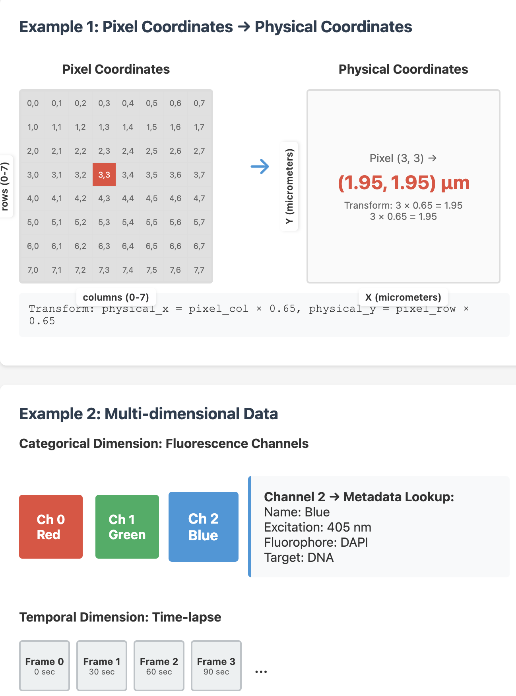
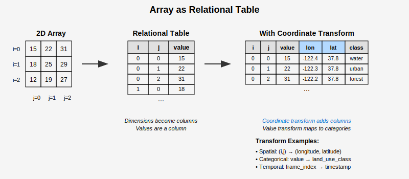
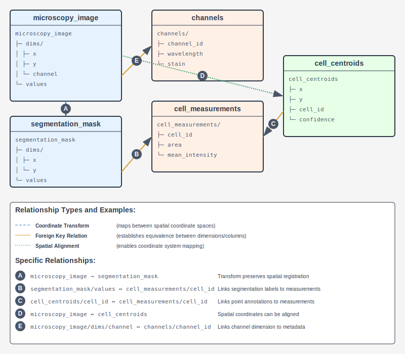

# Dataset Construction from Imaging, Annotations, and Associated Data Types

## Outline

```
1. Introduction
    1.1. Motivating use cases and requirements
    1.2. Approach: container format and microformats
2. Multidimensional Array Data Modelling
    2.1. Arrays as spatial data
    2.2. Arrays as relational data (tables)
    2.3. Implicit coordinate space and reference mechanism
    2.4. API: spatial query, transform, and table queries.
3. Representing a dataset
    3.1. DataSet: DataSource, Transforms and Relations
    3.2. Why not Croissant? Limitations of Croissant
    3.3. Approach: versioning, jsonld, json-schema, validation and interogation
4. Specifications
    4.1. Transform specification
    4.2. CoordinateSpace specification
    4.3. DataSource specification
    4.4. DataSet specification
```

## Introduction

### Motivating use cases and requirements

This aim here is to develop a standard and specification that is able to describe diverse scientific datasets, in particular those that include images. Much of the data we are intereseted in involves not just images, but large multi-dimensional arrays. This data needs to be findable, reusable, self-describing, and usable for training the models that will enable us to understand biology across scales.

Large-scale scientific datasets cannot be loaded entirely into memory or transmitted in full, requiring query mechanisms that return bounded subsets of data. Users need to specify regions of interest and receive only the relevant portions of datasets, whether querying temporal windows from time-series data or spatial extents from imaging datasets. This windowed access pattern becomes essential for interactive analysis and scalable processing workflows. Enabling these queries, and relating spatial data to other data types, requires a standard and specification that is able to describe the data and their relationships.

### Container format and microformats

The approach centers on defining a container document that references the constituent files of a dataset and defines the relationships between them that establish shared semantic context. Rather than prescribing representations for each data type, this container functions as a lightweight database schema that binds together arrays, point-sets, metadata tables, and other spatial data through explicit relational mappings. The container document specifies how dimensions in one array correspond to lookup keys in metadata tables, how coordinate systems relate through transforms, and how temporal or categorical indices resolve to external definitions.

This design prioritizes composition over comprehensiveness by making decisive choices about file formats and schemas for each data role. The relational model enables this composition by providing the semantic layer that connects heterogeneous data types without requiring them to share internal representations. Being selective about formats and microdata schemas is essential to this approach—it aims to constrain dependencies while maintaining adaptability through a vocabulary that can incorporate new formats without redesigning the core relational model.

## Dataset Organization and Layout

The datasets that we need to describe come from a variety of sources, but need to be described in a uniform way for search and discovery. Here we'll defined two terms:

* **Data Set**: A collection of "experiments" that comprise a study or group of studies. JumpCP, the CryoET-portal collection, AllenCellDynamic are all examples of data sets.
* **Experiment**: A single experiment, or a single run of an experiment. A single experiment might be a single acquisition on a microscope.

Datasets should be organized into a flat hierarchy of data sets and experiments. The root of the hierarch is the data set. It should contain no metadata on it's own, but should contain a list of experiments. Each experiment should be a directory that contains the data for that experiment. This must include a `metadata.json` file that describes the locations of all the associated data and any metadata required to support search and discovery.

```
<dataset_root>
    <experiment_1>
        metadata.json
        images.zarr
        point_annotations.parquet
        segmentation.zarr
    <experiment_2>
    ...
    <experiment_n>
```

## Multidimensional Array Data Modelling

### Arrays as spatial data

Spatial data (arrays, points, tracks, meshes) is associated with coordinates drawn from different dimensions. Each dimension represents a set of numbers. These numbers have an origin and may be identified with a measure by specifying a unit. Often a dimension is, or can be embedded in, a vector space. They can be grouped together to form higher-dimensional space - a coordinate system.

Consider a microscopy image stored as a 1024×1024 pixel array. Each pixel location is identified by two numbers: a row index (0-1023) and column index (0-1023). These form two dimensions. Together, they create a 2D coordinate system where any pixel can be located by its (row, column) pair.

However, these pixel indices alone don't tell us the physical size. If we know each pixel represents 0.65 micrometers, we can create a physical coordinate system with dimensions measured in micrometers. Now the same image spans 665.6×665.6 micrometers, and location (512, 512) in pixel coordinates corresponds to (332.8, 332.8) in physical coordinates.

A time-lapse adds a third dimension - frame number. Frame 0, 1, 2... might correspond to measurements at 0, 30, 60 seconds. Some dimensions are categorical rather than continuous: a multi-channel image might have dimension "channel" with values 0, 1, 2 representing red, green, and blue fluorescence channels.

Coordinate transformations (hereafter "transforms") allow us to map vectors in one coordinate system to another. Spatial transforms allow us to map coordinates meaningfully between arrays and other spatial data types. These mappings can be used to give dimensions meaning.

A satellite image has pixel coordinates, but we need to know where it sits on Earth. A transformation maps pixel (0, 0) to UTM coordinates (463312.5, 4190887.5) meters, with each pixel representing 30×30 meters. This transform - often an affine transformation - scales, rotates, and translates coordinates from one system to another.

In microscopy, we might transform from image pixels to stage coordinates to align multiple fields of view. The transform accounts for the microscope's orientation and stage position. For 3D data, transforms handle the different sampling rates: perhaps 0.65 micrometers laterally but 2 micrometers between z-slices.

Transforms also apply to non-spatial dimensions. Time indices can map to absolute timestamps. Intensity values from a camera (0-65535) can transform to calibrated photon counts using the detector's response curve. Even categorical dimensions use transforms: channel index 0 maps to a table row containing wavelength, fluorophore name, and acquisition parameters.



### Arrays as relational tables

An array can be conceptualized as a relational table where each dimension corresponds to a column containing indices, and an additional column holds the array values. Coordinate transforms extend this model by joining new columns—a pixel location (i, j) might map to geographic coordinates (longitude, latitude) through a spatial transform. Values themselves can be treated as a dimension, enabling transformations to categorical schemes or other representations.



This relational perspective differs fundamentally from how arrays are stored. Where a tables would store each row explicitly, arrays store only values. Storage layouts optimize for access patterns like slicing, chunking, or compression. These optimizations make arrays efficient for numerical computation but obscure how readily they support relational operations like joins or filters.

### Implicit coordinate space and reference mechanism

Multidimensional arrays require systematic naming of dimensions to enable coordinate transforms, establish relationships, and support queries. Each dimension needs an identifier to participate in mappings between coordinate systems, join operations with tabular data, or transformations that affect specific axes. With consistent dimension naming, operations like "transform the spatial dimensions but preserve the time dimension" or "join array values with table rows" become possible.

The reference mechanism provides a hierarchical naming convention that addresses this need. For arrays, coordinate dimensions follow the pattern `<datasource_id>/dims/<dimension_id>`, while array values—treated as a special dimension—are referenced as `<datasource_id>/values`. When dimension names are not explicitly specified, they receive default identifiers following the xarray convention: `dim_0`, `dim_1`, `dim_2`, and so forth, ordered by axis position. Each implicit dimension also carries default properties: coordinate dimensions have type `index` and unit `index`, while the values dimension inherits its type and unit from the array's data type.

This approach extends beyond arrays to all spatial data types. Every spatial data source—whether array, point set, or mesh—defines an implicit coordinate space identified by the data source's own identifier. The coordinate space encompasses all dimensions of that data source and serves as the domain or range for coordinate transforms. Table data sources follow a parallel pattern where columns are referenced as `<datasource_id>/<column_name>`, enabling seamless integration through foreign key relationships.

**Examples:**

A 3D microscopy array named `image_stack` with unspecified dimension names would have:
- `image_stack` - the implicit coordinate space
- `image_stack/dims/dim_0` - first dimension (default name)
- `image_stack/dims/dim_1` - second dimension (default name)
- `image_stack/dims/dim_2` - third dimension (default name)
- `image_stack/values` - pixel intensity values

With explicit dimension names, the same array might use:
- `image_stack/dims/x` - X spatial dimension
- `image_stack/dims/y` - Y spatial dimension
- `image_stack/dims/z` - Z spatial dimension

A point cloud `cell_centers` defines coordinate space `cell_centers`, with position columns referenced as `cell_centers/x`, `cell_centers/y`, `cell_centers/z`, and metadata as `cell_centers/cell_type`.



### API: spatial query, transform, and table queries

> WARNING: These are just examples to illustrate what the API might look like. The API is not yet specified.

Spatial queries extract bounded regions from arrays and point sets through coordinate-based selection. A query specifies a bounding box in the source coordinate space and optionally a target resolution. For arrays, this returns a lazy view over the requested region, loading data only when accessed. Point queries return all points within the spatial bounds. The query mechanism handles coordinate system alignment automatically when the bounding box is specified in a different coordinate space than the data source.

```python
# Query microscopy array with physical coordinates
bbox = BoundingBox(x=(10.5, 50.2), y=(20.1, 60.8), z=(0, 10))  # micrometers
scale = 2  # downsample by factor of 2
region = dataset.query_spatial('microscopy_image', bbox, scale=scale,
                               coordinate_space='physical_space')

# Query points in image pixel coordinates
pixel_bbox = BoundingBox(x=(100, 500), y=(200, 600))
points = dataset.query_spatial('cell_centroids', pixel_bbox,
                               coordinate_space='microscopy_image')
```

Coordinate transforms map tuples of numeric coordinates between compatible spaces through a chain of transformations. The API resolves transformation paths automatically when spaces are connected through one or more defined transforms. Transform operations apply to individual coordinate tuples or arrays of coordinates, preserving the relationship between input and output dimensions as specified in the transform definition.

```python
# Transform pixel coordinates to physical space
pixel_coords = np.array([[256, 512], [128, 384]])  # (x, y) pixels
physical = dataset.transform(pixel_coords,
                           from_space='microscopy_image',
                           to_space='physical_space')
# Returns: [[166.4, 332.8], [83.2, 249.6]]  # micrometers

# Transform with dimension subset
coords_3d = np.array([[256, 512, 10]])  # (x, y, channel)
physical_xy = dataset.transform(coords_3d[:, :2],  # only x,y
                              from_space='microscopy_image',
                              to_space='stage_coordinates')
```

Table queries leverage the relational view of arrays where dimensions serve as join keys with external tables. Array values or coordinate indices join with table columns through defined equivalence relations, enabling queries that combine spatial and tabular data. For categorical dimensions, queries resolve indices to their associated metadata. For value dimensions, queries can filter or aggregate based on relationships established with measurement tables.

```python
# Query cell measurements for specific segmentation labels
labels = dataset.query_spatial('segmentation', bbox)
measurements = dataset.query_table('measurements',
                                 where='cell_id IN segmentation/values',
                                 values=labels.unique())

# Resolve categorical dimension to metadata
channel_idx = 2
channel_info = dataset.query_table('fluorescence_channels',
                                  where='@row_index = microscopy_image/dims/channel',
                                  values=[channel_idx])
# Returns: {'fluorophore': 'GFP', 'wavelength': 488, 'exposure_ms': 100}

# Join array coordinates with annotation table
coords = dataset.query_table('annotations',
                           join_on=['microscopy_image/dims/x',
                                   'microscopy_image/dims/y'],
                           where='confidence > 0.8')
```

## Representing a dataset

### DataSet: DataSource, Transforms and Relations

The DataSet serves as the top-level container that organizes heterogeneous data sources into a coherent collection. A dataset consists of three primary components: sources, transforms, and relations. Sources represent the actual data resources—arrays, tables, point sets, or meshes—each with its own implicit coordinate space and internal structure:

```json
{
  "id": "cell_analysis_dataset",
  "name": "Cell Analysis Dataset",
  "description": "Microscopy images with cell segmentation and measurements",
  "sources": [
    {
      "id": "fluorescence",
      "name": "Fluorescence Stack",
      "type": "array",
      "encodingFormat": "application/zarr+ome",
      "contentUrl": "https://example.com/image.zarr"
    },
    {
      "id": "measurements",
      "name": "Cell Measurements",
      "type": "table",
      "encodingFormat": "application/parquet",
      "contentUrl": "https://example.com/measurements.parquet"
    }
  ]
}
```

Transforms define mathematical mappings between coordinate spaces, enabling spatial alignment and conversion between different reference frames. Relations establish that specific columns or dimensions across different data sources represent the same semantic entity—functionally equivalent to foreign key relationships in relational databases. These components form a lightweight relational schema that binds together diverse data types without requiring shared internal representations.

The assembly of these components creates a queryable network where data from different sources can be accessed, transformed, and joined through their established relationships. Sources provide the foundational data and coordinate spaces; transforms create paths for coordinate conversion between these spaces:

```json
"transforms": [{
  "id": "fluorescence_to_segmentation",
  "input": "fluorescence",
  "output": "segmentation",
  "transform": "identity",
  "description": "Shared coordinate space"
}]
```

Relations declare that entities in different sources represent the same thing, enabling join operations. When a relation specifies `{"equivalent": ["segmentation/values", "measurements/cell_id"]}`, it declares that each unique value in the segmentation array corresponds to a specific cell_id in the measurements table:

```json
"relations": [{
  "id": "cell_identifiers",
  "equivalent": ["segmentation/values", "measurements/cell_id"],
  "description": "Segmentation label 42 means the same cell as row with cell_id=42"
}]
```

This relational structure enables queries that combine spatial and tabular operations. For example, to analyze cells in a spatial region:

```python
# 1. Query segmentation array for a bounding box
bbox = BoundingBox(x=(100, 200), y=(150, 250))
labels = dataset['segmentation'][bbox]  # Returns label array with values like [12, 17, 42, 51]

# 2. Use the relation to filter measurements table
cell_measurements = dataset['measurements'].filter(cell_id=labels.unique())
# Returns DataFrame with rows where cell_id ∈ {12, 17, 42, 51}

# Result: measurements for only the cells visible in the spatial region
# | cell_id | area | mean_intensity | eccentricity |
# |---------|------|----------------|--------------|
# |    12   | 245  |     1823.4     |    0.72      |
# |    17   | 189  |     2156.7     |    0.84      |
# |    42   | 312  |     1967.2     |    0.65      |
# |    51   | 203  |     2234.1     |    0.79      |
```

### Why not Croissant? Limitations of Croissant

### Why not Croissant? Limitations of Croissant

Croissant addresses machine learning dataset documentation through several key mechanisms:
- **RecordSet abstraction**: Creates tabular views of data for consumption by training pipelines and dataset viewers
- **Distribution mechanism**: Handles file organization and dataset structure

Croissant focuses on assembling training data. Here, we need to comprehensively describing multi-modal datasets with complex relationships. While Croissant transforms diverse data sources, the `mlcroissant` library only supports a limited set of file and value types.

Instead, this design focuses on a JSON Schema based approach. `DataSet` is designed to incorporate ideas from Croissant, but with the added notion of spatial transforms. JSON Schema has excellent tooling support. We can generate pydantic classes from the schemas automatically, and syntax highlighting and autocomplete in compatible errors.

## Specification

The sections below outline the specific types, their fields, and their constraints. These are based on the schemas found in the [noid repository](https://github.com/nclack/noid/tree/main/schemas). The code in that repository was used for exploratory work to define this specification.

### Transform specification

#### Transform Types Overview

| Transform Type | Property Name | Parameter Type | Description |
|---|---|---|---|
| Identity | `identity` | String constant | No transformation applied |
| Translation | `translation` | Array of numbers | Shift coordinates by offset vector |
| Scale | `scale` | Array of positive numbers | Scale coordinates by factor(s) |
| Axis Mapping | `mapAxis` | Array of integers | Permutation vector specifying input dimension indices |
| Homogeneous | `homogeneous` | 2D Array of numbers | Apply homogeneous transformation matrix (affine/projective) |
| DisplacementLookupTable | `displacements` | String or Object | Apply displacement field from file |
| CoordinateLookupTable | `lookup_table` | String or Object | Apply coordinate lookup table from file |

#### Example Value Formats

| Transform Type | Example Value |
|---|---|
| Identity | `"identity"` |
| Translation | `{"translation": [10, 20, 5]}` |
| Scale | `{"scale": [2.0, 1.5, 0.5]}` |
| Axis Mapping | `{"mapAxis": [1, 0, 2]}` |
| Homogeneous | `{"homogeneous": [[2.0, 0, 0, 10], [0, 1.5, 0, 20], [0, 0, 0.5, 5], [0, 0, 0, 1]]}` |
| Displacements (string) | `{"displacements": "path/to/displacement_field.zarr"}` |
| Displacements (object) | `{"displacements": {"path": "field.zarr", "interpolation": "linear"}}` |
| Coordinates | `{"lookup_table": {"path": "path/to/lut.zarr", "interpolation": "linear"}}` |

#### Parameter Specifications

##### Identity Transform

**Example:** `"identity"`

Applies no transformation - coordinates remain unchanged.

| Property | Type | Required | Constraints | Description |
|---|---|---|---|---|
| Identity string | String | Yes | Must be `"identity"` | Identity transformation |

##### Translation Transform

**Example:** `{"translation": [10, 20, 5]}`

Shifts coordinates by adding the translation vector. A 3D point at (0, 0, 0) becomes (10, 20, 5).

| Property | Type | Required | Constraints | Description |
|---|---|---|---|---|
| `translation` | Array | Yes | ≥1 numeric elements | Translation vector |

##### Scale Transform

**Example:** `{"scale": [2.0, 1.5, 0.5]}`

Multiplies coordinates by scale factors. A 3D point at (1, 2, 4) becomes (2, 3, 2).

| Property | Type | Required | Constraints | Description |
|---|---|---|---|---|
| `scale` | Array | Yes | ≥1 positive numeric elements | Scale factors (must be > 0) |

##### Axis Mapping Transform

**Example:** `{"mapAxis": [1, 0, 2]}`

Reorders dimensions - swaps first two dimensions while keeping third unchanged. A 3D point at (x, y, z) becomes (y, x, z).

| Property | Type | Required | Constraints | Description |
|---|---|---|---|---|
| `mapAxis` | Array | Yes | ≥1 non-negative integer elements | Permutation vector of 0-based input dimension indices |

**mapAxis Array Constraints:**
- Elements: Non-negative integers (≥ 0)
- Length: Determines number of output dimensions
- Values: 0-based indices of input dimensions

##### Homogeneous Transform

**Example:** `{"homogeneous": [[2.0, 0, 0, 10], [0, 1.5, 0, 20], [0, 0, 0.5, 5], [0, 0, 0, 1]]}`

Applies matrix transformation in homogeneous coordinates. This example scales by (2, 1.5, 0.5) and translates by (10, 20, 5).

| Property | Type | Required | Constraints | Description |
|---|---|---|---|---|
| `homogeneous` | 2D Array | Yes | ≥2 rows of numeric arrays | Homogeneous transformation matrix (affine/projective) |

##### DisplacementLookupTable Transform

**Example:** `{"displacements": "path/to/displacement_field.zarr"}` or `{"displacements": {"path": "field.zarr", "interpolation": "linear"}}`

Applies spatially-varying displacement vectors from a lookup table. Used for non-linear deformations like image warping.

| Property | Type | Required | Constraints | Description |
|---|---|---|---|---|
| `displacements` | String or Object | Yes | See displacement object spec | Path or configuration for displacement field |

**Displacement Object (when object form is used):**
| Property | Type | Required | Constraints | Description |
|---|---|---|---|---|
| `path` | String | Yes | Valid file path | Path to displacement field file |
| `interpolation` | String | No | `"linear"`, `"nearest"`, `"cubic"` | Interpolation method |
| `extrapolation` | String | No | `"nearest"`, `"zero"`, `"constant"` | Extrapolation method |

##### CoordinateLookupTable Transform

**Example:** `{"lookup_table": {"path": "path/to/lut.zarr", "interpolation": "linear"}}`

Maps coordinates through a lookup table that directly specifies output coordinates for each input position.

| Property | Type | Required | Constraints | Description |
|---|---|---|---|---|
| `lookup_table` | String or Object | Yes | See lookup table object spec | Path or configuration for coordinate lookup table |

**Lookup Table Object (when object form is used):**
| Property | Type | Required | Constraints | Description |
|---|---|---|---|---|
| `path` | String | Yes | Valid file path | Path to coordinate lookup table file |
| `interpolation` | String | No | `"linear"`, `"nearest"`, `"cubic"` | Interpolation method |
| `extrapolation` | String | No | `"nearest"`, `"zero"`, `"constant"` | Extrapolation method |

#### Schema Rules

##### General Constraints

| Rule | Description |
|---|---|
| Single Property | Each transform object must contain exactly one transform property |
| No Additional Properties | Transform objects cannot contain properties other than the specified transform property |
| Finite Numbers | All numeric values must be finite (not NaN or infinity) |
| Self-Describing | Transform type is inferred from property name, not explicit type field |

##### Array Constraints

| Transform | Minimum Items | Item Type | Additional Constraints |
|---|---|---|---|
| `identity` | 0 (empty) | N/A | Must be exactly empty |
| `translation` | 1 | Number | None |
| `scale` | 1 | Number | Must be > 0 |
| `homogeneous` | 2 | Array of numbers | 2D matrix structure |

##### Integer Constraints

| Context | Constraint | Description |
|---|---|---|
| `mapAxis` elements | `≥ 0` | Non-negative integers representing 0-based dimension indices |

##### Enumerated Values

| Property | Valid Values |
|---|---|
| `interpolation` | `"linear"`, `"nearest"`, `"cubic"` |
| `extrapolation` | `"nearest"`, `"zero"`, `"constant"` |

### Coordinate System Specification

#### Schema Components Overview

| Component | Description | Key Properties |
|---|---|---|
| Dimension | A single axis within a coordinate space | `id`, `unit`, `type` |
| Coordinate System | Collection of dimensions defining a coordinate space | `id`, `dimensions`, `description` |
| Coordinate Transform | Mapping between input and output coordinate spaces | `id`, `input`, `output`, `transform`, `description` |

#### Example Value Formats

| Component | Example Value |
|---|---|
| Dimension | `{"id": "x", "unit": "micrometers", "type": "space"}` |
| Coordinate System | `{"id": "physical_space", "dimensions": ["x", "y", "z"]}` |
| Coordinate Transform | `{"id": "physical_to_pixel", "input": "physical_space", "output": "image_coordinates", "transform": {"scale": [0.1, 0.1, 0.2]}}` |

#### Component Specifications

##### Dimension

**Example:** `{"id": "x", "unit": "micrometers", "type": "space"}`

Defines a single axis within a coordinate space with its measurement unit and classification.

| Property | Type | Required | Constraints | Description |
|---|---|---|---|---|
| `id` | String | Yes | Non-empty, unique across dataset | Unique identifier for the dimension |
| `unit` | String | Yes | Non-empty | Unit of measurement |
| `type` | String | Yes | `"space"`, `"time"`, `"other"`, `"index"` | Dimension type classification |

**Unit Constraints:**
| Dimension Type | Unit Requirements |
|---|---|
| `"space"`, `"time"` | SHOULD use UDUNITS-2 terms (e.g., "micrometers", "seconds", "radians") |
| All types | "index" and "arbitrary" are valid |
| `"index"` type | MUST use "index" unit |

**Type Constraints:**
- Dimensions with unit "index" MAY have any type
- Dimensions with type "index" MUST have unit "index"

##### Coordinate System

**Example:** `{"id": "physical_space", "dimensions": ["x", "y", "z"], "description": "3D physical coordinate system"}`

Collection of dimensions that together define a coordinate space for positioning data elements.

| Property | Type | Required | Constraints | Description |
|---|---|---|---|---|
| `id` | String | Yes | Non-empty, unique across dataset | Unique identifier for the coordinate system |
| `dimensions` | Array | Yes | ≥1 element | List of dimension specifications |
| `description` | String | No | Non-empty if present | Optional description of the coordinate system |

**Dimensions Array:**
Each element must be either:
- String: Reference to a dimension by its ID
- Object: Complete Dimension object (see Dimension specification above)

**Examples of dimension specifications:**
- By reference: `["x", "y", "z"]`
- Inline objects: `[{"id": "row", "unit": "index", "type": "index"}, {"id": "col", "unit": "index", "type": "index"}]`
- Mixed: `["x", "y", {"id": "channel", "unit": "arbitrary", "type": "other"}]`

##### Coordinate Transform

**Example:** `{"id": "physical_to_pixel", "input": "physical_space", "output": "image_coordinates", "transform": {"scale": [0.1, 0.1, 0.2]}}`

Mathematical mapping between input and output coordinate spaces with transform definition.

| Property | Type | Required | Constraints | Description |
|---|---|---|---|---|
| `id` | String | Yes | Non-empty, unique across dataset | Unique identifier for the coordinate transform |
| `input` | String, Array, or Object | Yes | See input/output specification | Input coordinate space specification |
| `output` | String, Array, or Object | Yes | See input/output specification | Output coordinate space specification |
| `transform` | Object | Yes | Valid transform from transforms schema | Transform definition |
| `description` | String | No | Non-empty if present | Optional description of the coordinate transform |

**Input/Output Specifications:**
Each must be one of:
- String: Reference to a coordinate system by its ID
- Array: List of dimension specifications (strings or Dimension objects)
- Object: Complete Coordinate System object

**Transform Property:**
Must reference a valid transform definition from the transforms vocabulary as specified in `../transforms/transforms.v0.schema.json#/definitions/Transform`.

#### Dimension Type Reference

| Type | Description | Typical Units | Examples |
|---|---|---|---|
| `"space"` | Spatial dimensions | UDUNITS-2 spatial terms | "micrometers", "millimeters", "meters" |
| `"time"` | Temporal dimensions | UDUNITS-2 time terms | "seconds", "milliseconds", "hours" |
| `"other"` | Channels, indices, categories | "arbitrary", "index", custom | "arbitrary", "wavelength", "intensity" |
| `"index"` | Array index dimensions | "index" (required) | "index" |

#### Common Unit Examples

| Category | Valid Units |
|---|---|
| Spatial | "micrometers", "millimeters", "meters", "pixels", "nanometers" |
| Temporal | "seconds", "milliseconds", "hours", "minutes" |
| Angular | "radians", "degrees" |
| Universal | "index", "arbitrary" |
| Index Type | "index" (only valid unit for type "index") |

#### Schema Rules

##### General Constraints

| Rule | Description |
|---|---|
| Unique IDs | All IDs must be unique within their scope (dimensions, coordinate systems, transforms) |
| Non-empty Strings | All string properties must be non-empty |
| No Additional Properties | Objects cannot contain properties other than those specified |
| Reference Validation | ID references should exist within the dataset scope |

##### Array Constraints

| Component | Property | Minimum Items | Item Types |
|---|---|---|---|
| Coordinate System | `dimensions` | 1 | String (ID reference) or Dimension object |
| Dimension (in arrays) | N/A | N/A | Complete Dimension object or string ID |

##### Type Validation Rules

| Validation | Rule | Example |
|---|---|---|
| Index Type Constraint | If `type` is "index", then `unit` MUST be "index" | `{"id": "i", "unit": "index", "type": "index"}` ✓ |
| Index Unit Flexibility | If `unit` is "index", `type` can be any valid type | `{"id": "spatial_idx", "unit": "index", "type": "space"}` ✓ |
| UDUNITS-2 Recommendation | Space/time types SHOULD use UDUNITS-2 terms | `{"id": "x", "unit": "micrometers", "type": "space"}` ✓ |

##### Invalid Examples

| Invalid Case | Example | Reason |
|---|---|---|
| Index type with non-index unit | `{"id": "bad", "unit": "micrometers", "type": "index"}` | Index type requires "index" unit |
| Empty dimensions array | `{"id": "sys", "dimensions": []}` | Must have at least one dimension |
| Missing required property | `{"id": "dim", "type": "space"}` | Missing required "unit" property |
| Empty string ID | `{"id": "", "unit": "index", "type": "index"}` | ID cannot be empty |

#### Coordinate Transform Examples

##### Simple System Reference
```json
{
  "id": "transform_1",
  "input": "world_coordinates",
  "output": "pixel_coordinates",
  "transform": {"scale": [0.1, 0.1]}
}
```

##### Inline Dimension Arrays
```json
{
  "id": "transform_2",
  "input": [
    {"id": "x_world", "unit": "micrometers", "type": "space"},
    {"id": "y_world", "unit": "micrometers", "type": "space"}
  ],
  "output": [
    {"id": "row", "unit": "index", "type": "index"},
    {"id": "col", "unit": "index", "type": "index"}
  ],
  "transform": {"homogeneous": [[0.1, 0, 100], [0, 0.1, 200], [0, 0, 1]]}
}
```

##### Mixed References
```json
{
  "id": "transform_3",
  "input": ["x", "y", "z"],
  "output": "image_space",
  "transform": {"translation": [10, 20, 5]},
  "description": "Convert 3D coordinates to image space with offset"
}
```

### Data Sources Specification

#### Schema Components Overview

| Component | Description | Key Properties |
|---|---|---|
| Data Source | A typed, addressable spatial or tabular data resource | `id`, `name`, `description`, `contentUrl`, `type`, `encodingFormat` |

#### Example Value Formats

| Data Source Type | Example Value |
|---|---|
| Array | `{"id": "microscopy_image", "name": "Fluorescence Stack", "type": "array", "encodingFormat": "application/zarr+ome", "contentUrl": "data.zarr#multiscale/0"}` |
| Table | `{"id": "cell_measurements", "name": "Cell Analysis Data", "type": "table", "encodingFormat": "application/parquet", "contentUrl": "measurements.parquet"}` |
| Points | `{"id": "centroids", "name": "Cell Centers", "type": "points", "encodingFormat": "application/parquet", "contentUrl": "centroids.parquet"}` |
| Mesh | `{"id": "surfaces", "name": "Cell Boundaries", "type": "mesh", "encodingFormat": "application/neuroglancer-precomputed", "contentUrl": "meshes/cells"}` |

#### Component Specifications

##### Data Source

**Example:** `{"id": "fluorescence_stack", "name": "3D Fluorescence Microscopy", "description": "DAPI and GFP channels acquired at 63x magnification", "contentUrl": "https://example.com/data.zarr#images/stack", "type": "array", "encodingFormat": "application/zarr+ome"}`

Defines a typed, addressable resource containing spatial or tabular data with format-specific constraints.

| Property | Type | Required | Constraints | Description |
|---|---|---|---|---|
| `id` | String | Yes | Non-empty, unique across dataset | Unique identifier for the data source |
| `name` | String | Yes | Non-empty | Human-readable display name |
| `description` | String | Yes | Non-empty | Detailed description of the data source |
| `contentUrl` | String | Yes | Valid URI format | URI pointing to the data location |
| `type` | String | Yes | `"array"`, `"table"`, `"points"`, `"mesh"` | Spatial data type classification |
| `encodingFormat` | String | Yes | Must match type constraints | Format specification for the data |
| `sha256` | String | No | 64-character hexadecimal | Optional SHA256 hash for integrity |

#### Data Source Types

##### Array Data Sources

**Type:** `"array"`
**Required Encoding Format:** `"application/zarr+ome"`

Array data sources represent multidimensional arrays for images, volumes, and other gridded data.

**Recommended Uses:**
- Microscopy images
- Medical volumes
- Satellite imagery
- Time series grids

**Properties:**
- MUST support multidimensional coordinate systems
- SHOULD follow OME-Zarr metadata conventions
- MAY use fragment identifiers for sub-array addressing

##### Table Data Sources

**Type:** `"table"`
**Required Encoding Format:** `"application/parquet"`

Table data sources represent structured tabular data with rows and columns.

**Recommended Uses:**
- Metadata tables
- Measurement data
- Annotation data
- Categorical data

**Properties:**
- SHOULD support foreign key relationships with other data sources
- MUST use columnar Parquet format for efficient querying
- MAY reference columns using `<datasource_id>/<column_name>` pattern

##### Point Data Sources

**Type:** `"points"`
**Required Encoding Format:** `"application/parquet"`

Point data sources represent point cloud data with coordinates and optional features.

**Recommended Uses:**
- Cell centroids
- Landmark points
- Sparse annotations
- GPS coordinates

**Properties:**
- MUST include coordinate columns
- MAY include additional feature columns
- SHOULD use structured coordinate representation

##### Mesh Data Sources

**Type:** `"mesh"`
**Required Encoding Format:** `"application/neuroglancer-precomputed"`

Mesh data sources represent 3D surface meshes with vertices and faces.

**Recommended Uses:**
- Cell surfaces
- Organ boundaries
- 3D reconstructions
- Surface-based visualizations

**Properties:**
- MUST represent 3D surface data
- SHOULD support hierarchical level-of-detail
- MAY integrate with Neuroglancer visualization tools

#### Format Constraints

Data source objects MUST enforce strict type-format mappings:

| Type | Required Encoding Format | Validation Rule |
|---|---|---|
| `"array"` | `"application/zarr+ome"` | Must validate as OME-Zarr format |
| `"table"` | `"application/parquet"` | Must validate as Apache Parquet format |
| `"points"` | `"application/parquet"` | Must validate as Apache Parquet format |
| `"mesh"` | `"application/neuroglancer-precomputed"` | Must validate as Neuroglancer format |

#### URI Addressing

##### Fragment Identifiers

Data sources MAY use URI fragment identifiers to address sub-components within container formats.

**Pattern:** `<base_uri>#<fragment_path>`

**Examples:**
- `https://example.com/data.zarr#labels/cells` - Sub-array within container
- `https://example.com/data.zarr#multiscale/0` - Specific resolution level
- `https://example.com/data.h5#/measurements/cell_stats` - HDF5 internal dataset

##### Container Format Support

| Format | Fragment Support | Example Paths |
|---|---|---|
| OME-Zarr | Arrays, labels, multiscale | `#labels/cells`, `#multiscale/0` |
| HDF5 | Datasets, groups | `#/data/measurements`, `#/metadata` |
| Multi-resolution | Level specification | `#level/0`, `#resolution/high` |

#### ID-Based Referencing

Data sources support hierarchical referencing through structured ID patterns:

##### Coordinate Space References
Each spatial data source defines an implicit coordinate space:
```
<datasource_id>
```

##### Dimension References
Array dimensions use structured paths:
```
<datasource_id>/dims/<dimension_id>  # Coordinate dimensions
<datasource_id>/values               # Value dimension
```

##### Column References
Table columns use hierarchical naming:
```
<datasource_id>/<column_name>
```

#### Schema Rules

##### General Constraints

| Rule | Description |
|---|---|
| Unique IDs | All data source IDs must be unique within the dataset |
| Non-empty Strings | All required string properties must be non-empty |
| Type-Format Matching | Encoding format must match the specified type |
| URI Validation | Content URLs must be valid URI format |
| No Additional Properties | Objects cannot contain properties other than those specified |

##### Type Validation Rules

| Validation | Rule | Example |
|---|---|---|
| Array Format Constraint | If `type` is "array", then `encodingFormat` MUST be "application/zarr+ome" | `{"type": "array", "encodingFormat": "application/zarr+ome"}` ✓ |
| Table Format Constraint | If `type` is "table", then `encodingFormat` MUST be "application/parquet" | `{"type": "table", "encodingFormat": "application/parquet"}` ✓ |
| Points Format Constraint | If `type` is "points", then `encodingFormat` MUST be "application/parquet" | `{"type": "points", "encodingFormat": "application/parquet"}` ✓ |
| Mesh Format Constraint | If `type` is "mesh", then `encodingFormat` MUST be "application/neuroglancer-precomputed" | `{"type": "mesh", "encodingFormat": "application/neuroglancer-precomputed"}` ✓ |

##### SHA256 Validation

| Property | Pattern | Description |
|---|---|---|
| `sha256` | `^[a-f0-9]{64}$` | Exactly 64 hexadecimal characters |

##### Invalid Examples

| Invalid Case | Example | Reason |
|---|---|---|
| Type-format mismatch | `{"type": "array", "encodingFormat": "application/parquet"}` | Array type requires zarr+ome format |
| Empty required field | `{"id": "", "type": "table"}` | ID cannot be empty |
| Invalid URI format | `{"contentUrl": "not-a-uri"}` | Must be valid URI format |
| Invalid SHA256 | `{"sha256": "invalid"}` | Must be 64-character hexadecimal |
| Missing required property | `{"id": "test", "type": "array"}` | Missing required properties |

#### Complete Examples

##### Array Data Source with Fragment Addressing
```json
{
  "id": "fluorescence_stack",
  "name": "3D Fluorescence Microscopy",
  "description": "DAPI and GFP channels acquired at 63x magnification with 0.1μm pixel size",
  "contentUrl": "https://example.com/experiment1.zarr#images/stack",
  "type": "array",
  "encodingFormat": "application/zarr+ome",
  "sha256": "a1b2c3d4e5f6789012345678901234567890123456789012345678901234567890"
}
```

##### Table Data Source with Measurements
```json
{
  "id": "cell_measurements",
  "name": "Quantitative Cell Analysis",
  "description": "Area, intensity, and morphology measurements per cell with statistical summaries",
  "contentUrl": "https://example.com/measurements.parquet",
  "type": "table",
  "encodingFormat": "application/parquet"
}
```

##### Point Data Source for Centroids
```json
{
  "id": "nuclei_centroids",
  "name": "Nuclear Center Points",
  "description": "XYZ coordinates of detected cell nuclei with confidence scores",
  "contentUrl": "https://example.com/centroids.parquet",
  "type": "points",
  "encodingFormat": "application/parquet"
}
```

##### Mesh Data Source for Surfaces
```json
{
  "id": "cell_boundaries",
  "name": "3D Cell Surface Mesh",
  "description": "Triangulated surfaces of individual cell boundaries from segmentation",
  "contentUrl": "https://example.com/meshes/cells",
  "type": "mesh",
  "encodingFormat": "application/neuroglancer-precomputed"
}
```

#### Integration Patterns

##### Foreign Key Relationships
Table data sources can establish foreign key relationships with other data sources:

```json
{
  "relations": [{
    "equivalent": ["fluorescence_stack/values", "cell_measurements/cell_id"],
    "description": "Links image pixel values to measurement rows"
  }]
}
```

##### Coordinate Space Integration
Array data sources automatically define coordinate spaces for spatial transforms:

```json
{
  "transforms": [{
    "input": "fluorescence_stack",
    "output": "physical_space",
    "transform": {"scale": [0.1, 0.1, 0.2]}
  }]
}
```

##### Multi-Source Datasets
Complete datasets combine multiple data source types:

```json
{
  "sources": [
    {"id": "images", "type": "array", "encodingFormat": "application/zarr+ome"},
    {"id": "annotations", "type": "table", "encodingFormat": "application/parquet"},
    {"id": "landmarks", "type": "points", "encodingFormat": "application/parquet"},
    {"id": "surfaces", "type": "mesh", "encodingFormat": "application/neuroglancer-precomputed"}
  ]
}
```

### Dataset specification

#### Overview

The Dataset is the top-level object in the data model. It serves as a container that organizes heterogeneous data sources into a  queryable collection with coordinate transforms and equivalence relations.

#### Schema Components Overview

| Component | Description | Key Properties |
|---|---|---|
| Dataset | A complete collection of related spatial and tabular data sources | `id`, `name`, `description`, `sources` |
| Relation | Equivalence mapping between columns and dimensions across data sources | `equivalent` |

#### Example Value Formats

| Component | Example Value |
|---|---|
| Dataset | `{"id": "cell_analysis", "name": "Cell Analysis Dataset", "description": "Microscopy with measurements", "sources": [...]}` |
| Relation | `{"equivalent": ["segmentation/values", "measurements/cell_id"], "description": "Cell identifiers"}` |

#### Component Specifications

##### Dataset

**Example:** `{"id": "multi_modal_dataset", "name": "Multi-Modal Cell Analysis", "description": "Comprehensive cell analysis with images and measurements", "sources": [...], "transforms": [...], "relations": [...]}`

Defines a complete collection of related data sources with optional coordinate transforms and equivalence relations.

| Property | Type | Required | Constraints | Description |
|---|---|---|---|---|
| `id` | String | Yes | Non-empty, unique | Unique identifier for the dataset |
| `name` | String | Yes | Non-empty | Human-readable display name |
| `description` | String | Yes | Non-empty | Detailed dataset description |
| `sources` | Array | Yes | ≥1 data source object | Collection of data sources |
| `transforms` | Array | No | Coordinate transform objects | Optional coordinate transforms |
| `relations` | Array | No | Relation objects | Optional equivalence relations |

##### Relation

**Example:** `{"id": "cell_identifiers", "equivalent": ["segmentation/values", "cell_measurements/cell_id"], "description": "Links segmentation labels to measurement rows"}`

Defines equivalence relationships between columns and dimensions across data sources.

| Property | Type | Required | Constraints | Description |
|---|---|---|---|---|
| `equivalent` | Array | Yes | ≥2 unique string identifiers | List of equivalent entity references |
| `id` | String | No | Non-empty if present | Optional relation identifier |
| `description` | String | No | Non-empty if present | Optional relation description |

#### Entity Reference Types

Relations reference specific entity types within the dataset using hierarchical naming patterns:

##### Data Source Coordinate Spaces
**Pattern:** `<datasource_id>`
**Example:** `fluorescence_image`
**Description:** References the implicit coordinate space defined by a spatial data source

##### Table Columns
**Pattern:** `<datasource_id>/<column_name>`
**Example:** `measurements/cell_id`
**Description:** References a specific column within a table data source

##### Array Coordinate Dimensions
**Pattern:** `<datasource_id>/dims/<dimension_id>`
**Example:** `image_stack/dims/z`
**Description:** References a coordinate dimension within an array data source

##### Array Value Dimensions
**Pattern:** `<datasource_id>/values`
**Example:** `segmentation/values`
**Description:** References the value dimension of an array data source

#### Dataset Structure

##### Required Components

###### Data Sources
Every dataset MUST contain at least one data source. Data sources provide the fundamental data content and define the coordinate spaces available for transforms and relations.

**Supported Types:**
- Arrays (multidimensional gridded data)
- Tables (structured tabular data)
- Points (point cloud data)
- Meshes (3D surface data)

##### Optional Components

###### Coordinate Transforms
Mathematical mappings between coordinate spaces that enable spatial alignment of data sources. Transforms create a network of coordinate space relationships within the dataset.

**Common Use Cases:**
- Pixel-to-physical coordinate conversion
- Multi-resolution alignment
- Cross-modality registration

###### Equivalence Relations
Explicit mappings that identify semantically equivalent entities across data sources, enabling relational queries and foreign key relationships.

**Common Use Cases:**
- Linking array values to table rows
- Connecting measurements across modalities
- Establishing dimension correspondences

#### Validation Rules

##### General Constraints

| Rule | Description |
|---|---|
| Unique IDs | Dataset, data source, transform, and relation IDs must be unique within their scope |
| Non-empty Required Fields | All required string properties must be non-empty |
| Reference Consistency | Entity references in relations must correspond to actual dataset components |
| Pattern Matching | Entity identifiers must match pattern `^[^/]+(/[^/]+)*$` |

##### Cross-Reference Validation

| Validation | Rule | Example |
|---|---|---|
| Data Source References | `<datasource_id>` must exist in sources array | `fluorescence` → sources contains `{"id": "fluorescence", ...}` |
| Transform References | Transform input/output should reference dataset coordinate spaces | Transform input `"microscopy"` → data source exists |
| Relation Entity Types | Equivalent identifiers must follow valid entity patterns | `"measurements/area"` follows table column pattern |

##### Semantic Constraints

| Component | Constraint | Description |
|---|---|---|
| Relations | Minimum 2 equivalent items | Must establish equivalence between at least two entities |
| Relations | Unique equivalent items | No duplicate identifiers within single relation |
| Transforms | Coordinate space compatibility | Input/output spaces should be dimensionally compatible |

#### Integration Patterns

##### Spatial Data Alignment

Coordinate transforms enable spatial alignment between data sources:

```json
"transforms": [{
  "id": "image_to_physical",
  "input": "microscopy_image",
  "output": {
    "id": "physical_space",
    "dimensions": [
      {"id": "x", "unit": "micrometers", "type": "space"},
      {"id": "y", "unit": "micrometers", "type": "space"},
      {"id": "z", "unit": "micrometers", "type": "space"}
    ],
    "description": "3D physical coordinate system in micrometers"
  },
  "transform": {"scale": [0.1, 0.1, 0.2]}
}]
```

##### Cross-Modal Foreign Keys

Relations establish foreign key relationships between different data modalities:

```json
"relations": [{
  "equivalent": ["segmentation/values", "measurements/cell_id"],
  "description": "Cell identifier linking labels to measurements"
}]
```

##### Multi-Source Integration

Complete datasets integrate multiple data sources through transforms and relations:

- **Arrays** provide spatial context and coordinate systems
- **Tables** provide quantitative measurements and metadata
- **Points** provide sparse spatial annotations
- **Meshes** provide detailed surface representations
- **Transforms** align coordinate systems across sources
- **Relations** establish semantic equivalences

#### Complete Examples

##### Minimal Dataset
```json
{
  "id": "simple_dataset",
  "name": "Simple Microscopy Dataset",
  "description": "Basic fluorescence microscopy data",
  "sources": [{
    "id": "image",
    "name": "Fluorescence Image",
    "description": "2D fluorescence microscopy image",
    "contentUrl": "https://example.com/image.zarr",
    "type": "array",
    "encodingFormat": "application/zarr+ome"
  }]
}
```

##### Multi-Modal Dataset with Relations
```json
{
  "id": "cell_analysis_dataset",
  "name": "Cell Analysis Dataset",
  "description": "Microscopy images with cell segmentation and measurements",
  "sources": [
    {
      "id": "fluorescence",
      "name": "Fluorescence Stack",
      "description": "3D fluorescence microscopy data",
      "contentUrl": "https://example.com/image.zarr",
      "type": "array",
      "encodingFormat": "application/zarr+ome"
    },
    {
      "id": "segmentation",
      "name": "Cell Labels",
      "description": "Segmented cell labels",
      "contentUrl": "https://example.com/image.zarr#labels",
      "type": "array",
      "encodingFormat": "application/zarr+ome"
    },
    {
      "id": "measurements",
      "name": "Cell Measurements",
      "description": "Quantitative cell analysis",
      "contentUrl": "https://example.com/measurements.parquet",
      "type": "table",
      "encodingFormat": "application/parquet"
    }
  ],
  "transforms": [{
    "id": "fluorescence_to_segmentation",
    "input": "fluorescence",
    "output": "segmentation",
    "transform": "identity",
    "description": "Shared coordinate space"
  }],
  "relations": [{
    "id": "cell_identifiers",
    "equivalent": ["segmentation/values", "measurements/cell_id"],
    "description": "Cell identifier linking segmentation to measurements"
  }]
}
```

##### Complex Multi-Modal Dataset
```json
{
  "id": "comprehensive_analysis",
  "name": "Comprehensive Cell Analysis",
  "description": "Multi-modal dataset with arrays, tables, points, and meshes",
  "sources": [
    {
      "id": "microscopy",
      "name": "3D Microscopy",
      "type": "array",
      "encodingFormat": "application/zarr+ome",
      "contentUrl": "microscopy.zarr"
    },
    {
      "id": "measurements",
      "name": "Cell Measurements",
      "type": "table",
      "encodingFormat": "application/parquet",
      "contentUrl": "measurements.parquet"
    },
    {
      "id": "centroids",
      "name": "Cell Centers",
      "type": "points",
      "encodingFormat": "application/parquet",
      "contentUrl": "centroids.parquet"
    },
    {
      "id": "surfaces",
      "name": "Cell Surfaces",
      "type": "mesh",
      "encodingFormat": "application/neuroglancer-precomputed",
      "contentUrl": "meshes/cells"
    }
  ],
  "transforms": [
    {
      "id": "image_to_physical",
      "input": "microscopy",
      "output": {
        "id": "physical_space",
        "dimensions": [
          {"id": "x", "unit": "micrometers", "type": "space"},
          {"id": "y", "unit": "micrometers", "type": "space"},
          {"id": "z", "unit": "micrometers", "type": "space"}
        ],
        "description": "3D physical coordinate system in micrometers"
      },
      "transform": {"scale": [0.1, 0.1, 0.2]}
    },
    {
      "id": "centroids_to_physical",
      "input": "centroids",
      "output": "physical_space",
      "transform": "identity",
      "description": "Cell centroids are already in physical coordinates"
    },
    {
      "id": "surfaces_to_physical",
      "input": "surfaces",
      "output": "physical_space",
      "transform": "identity",
      "description": "Cell surfaces are already in physical coordinates"
    }
  ],
  "relations": [
    {
      "equivalent": ["measurements/cell_id", "centroids/cell_id", "surfaces/cell_id"],
      "description": "Cell identifiers across all modalities"
    },
    {
      "equivalent": ["microscopy/dims/x", "centroids/x", "surfaces/x_coord"],
      "description": "X coordinate correspondence"
    }
  ]
}
```

## References

- [croissant schema (ttl)][croissant-vocab]
- [croissant specification][croissant-specification]
- [ome-ngff v0.5 schemas][ome-ngff-v0.5-schemas]
- [zarr v3 specification][zarr-v3-specification]
- [RFC-5 Coordinate systems and transformations][RFC-5]
- [LinkML Multidimensional Arrays][linkml-mdarray]

[linkml-mdarray]: https://linkml.io/linkml/howtos/multidimensional-arrays.html
[croissant-vocab]: https://raw.githubusercontent.com/mlcommons/croissant/refs/heads/main/docs/croissant.ttl
[croissant-spec]: https://docs.mlcommons.org/croissant/docs/croissant-spec.html
[ome-ngff-v0.5-schemas]: https://github.com/ome/ngff/tree/v0.5/schemas
[zarr-v3-spec]: https://zarr-specs.readthedocs.io/en/latest/v3/core/index.html
[RFC-5]: https://github.com/ome/ngff/blob/main/rfc/5/index.md
