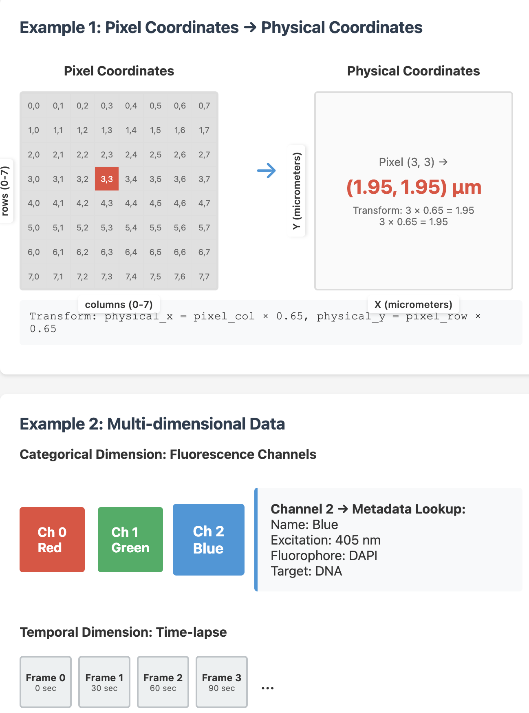
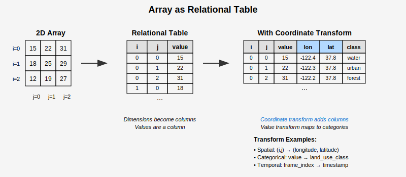

# Dataset Construction from Imaging, Annotations, and Associated Data Types

## Outline

```
1. Introduction
    1.1. Motivating use cases and requirements
    1.2. Approach: container format and microformats
2. Multidimensional Array Data Modelling
    2.1. Arrays as spatial data
    2.2. Arrays as relational data (tables)
    2.3. Model: Array, Dimension, CoordinateSpace, CoordinateTransform
    2.4. Implicit coordinate space and reference mechanism
    2.5. API: spatial query, transform, and table queries.
3. Representing a dataset
    3.1. Why Croissant?
    3.2. Limitations of Croissant
    3.3. Approach: versioning, jsonld, json-schema, validation and interogation
    3.4. Potential alternatives
        3.4.1. LinkML
            - [multidimensional array][linkml-mdarray] - upsides and downsides
4. Specification
    4.1. Spatial transform vocabulary
    4.2. Coordinate space vocabulary
    4.3. Spatial data formats and vocabulary: arrays, points, meshes, polygons, etc
    4.4. Ontologies: units
5. Examples
```

## Introduction

### Motivating use cases and requirements

This aim here is to develop a standard and specification that is able to describe diverse scientific datasets, in particular those that include images. Much of the data we are intereseted in involves not just images, but large multi-dimensional arrays. This data needs to be findable, reusable, self-describing, and usable for training the models that will enable us to understand biology across scales.

Large-scale scientific datasets cannot be loaded entirely into memory or transmitted in full, requiring query mechanisms that return bounded subsets of data. Users need to specify regions of interest and receive only the relevant portions of datasets, whether querying temporal windows from time-series data or spatial extents from imaging datasets. This windowed access pattern becomes essential for interactive analysis and scalable processing workflows. Enabling these queries, and relating spatial data to other data types, requires a standard and specification that is able to describe the data and their relationships.

### Container format and microformats

The approach centers on defining a container document that references the constituent files of a dataset and defines the relationships between them that establish shared semantic context. Rather than prescribing representations for each data type, this container functions as a lightweight database schema that binds together arrays, point-sets, metadata tables, and other spatial data through explicit relational mappings. The container document specifies how dimensions in one array correspond to lookup keys in metadata tables, how coordinate systems relate through transforms, and how temporal or categorical indices resolve to external definitions.

This design prioritizes composition over comprehensiveness by making decisive choices about file formats and schemas for each data role. The relational model enables this composition by providing the semantic layer that connects heterogeneous data types without requiring them to share internal representations. Being selective about formats and microdata schemas is essential to this approach—it aims to constrain dependencies while maintaining adaptability through a vocabulary that can incorporate new formats without redesigning the core relational model.

## Multidimensional Array Data Modelling

### Arrays as spatial data

Spatial data (arrays, points, tracks, meshes) is associated with coordinates drawn from different dimensions. Each dimension represents a set of numbers. These numbers have an origin and may be identified with a measure by specifying a unit. Often a dimension is, or can be embedded in, a vector space. They can be grouped together to form higher-dimensional space - a coordinate system.

Consider a microscopy image stored as a 1024×1024 pixel array. Each pixel location is identified by two numbers: a row index (0-1023) and column index (0-1023). These form two dimensions. Together, they create a 2D coordinate system where any pixel can be located by its (row, column) pair.

However, these pixel indices alone don't tell us the physical size. If we know each pixel represents 0.65 micrometers, we can create a physical coordinate system with dimensions measured in micrometers. Now the same image spans 665.6×665.6 micrometers, and location (512, 512) in pixel coordinates corresponds to (332.8, 332.8) in physical coordinates.

A time-lapse adds a third dimension - frame number. Frame 0, 1, 2... might correspond to measurements at 0, 30, 60 seconds. Some dimensions are categorical rather than continuous: a multi-channel image might have dimension "channel" with values 0, 1, 2 representing red, green, and blue fluorescence channels.

Coordinate transformations (hereafter "transforms") allow us to map vectors in one coordinate system to another. Spatial transforms allow us to map coordinates meaningfully between arrays and other spatial data types. These mappings can be used to give dimensions meaning.

A satellite image has pixel coordinates, but we need to know where it sits on Earth. A transformation maps pixel (0, 0) to UTM coordinates (463312.5, 4190887.5) meters, with each pixel representing 30×30 meters. This transform - often an affine transformation - scales, rotates, and translates coordinates from one system to another.

In microscopy, we might transform from image pixels to stage coordinates to align multiple fields of view. The transform accounts for the microscope's orientation and stage position. For 3D data, transforms handle the different sampling rates: perhaps 0.65 micrometers laterally but 2 micrometers between z-slices.

Transforms also apply to non-spatial dimensions. Time indices can map to absolute timestamps. Intensity values from a camera (0-65535) can transform to calibrated photon counts using the detector's response curve. Even categorical dimensions use transforms: channel index 0 maps to a table row containing wavelength, fluorophore name, and acquisition parameters.



### Arrays as relational tables

An array can be conceptualized as a relational table where each dimension corresponds to a column containing indices, and an additional column holds the array values. Coordinate transforms extend this model by joining new columns—a pixel location (i, j) might map to geographic coordinates (longitude, latitude) through a spatial transform. Values themselves can be treated as a dimension, enabling transformations to categorical schemes or other representations.



This relational perspective differs fundamentally from how arrays are stored. Where a tables would store each row explicitly, arrays store only values. Storage layouts optimize for access patterns like slicing, chunking, or compression. These optimizations make arrays efficient for numerical computation but obscure how readily they support relational operations like joins or filters.

## Transform Vocabulary

The transform vocabulary is intended to identify how to parameterize a small collection of transforms. This is strongly influenced by the collection of transforms defined in [RFC-5 Coordinate systems and transformations](https://github.com/ome/ngff/blob/main/rfc/5/index.md).

### Transform Types Overview

| Transform Type | Property Name | Parameter Type | Description |
|---|---|---|---|
| Identity | `identity` | Array (empty) | No transformation applied |
| Translation | `translation` | Array of numbers | Shift coordinates by offset vector |
| Scale | `scale` | Array of positive numbers | Scale coordinates by factor(s) |
| Axis Mapping | `mapAxis` | Object (string → string) | Remap axis names between coordinate spaces |
| Homogeneous | `homogeneous` | 2D Array of numbers | Apply homogeneous transformation matrix. Useful for affine or projective transformations. |
| Displacements | `displacements` | String or Object | Apply displacement field from file |
| Coordinates | `coordinates` | Object | Apply coordinate lookup table from file |

### Parameter Specifications

#### Identity Transform
| Property | Type | Required | Constraints | Description |
|---|---|---|---|---|
| `identity` | Array | Yes | Must be empty array `[]` | Identity transformation |

#### Translation Transform
| Property | Type | Required | Constraints | Description |
|---|---|---|---|---|
| `translation` | Array | Yes | ≥1 numeric elements | Translation vector |

#### Scale Transform
| Property | Type | Required | Constraints | Description |
|---|---|---|---|---|
| `scale` | Array | Yes | ≥1 positive numeric elements | Scale factors (must be > 0) |

#### Axis Mapping Transform
| Property | Type | Required | Constraints | Description |
|---|---|---|---|---|
| `mapAxis` | Object | Yes | ≥1 string key-value pairs | Input axis → output axis mapping |

**mapAxis Object Constraints:**
- Keys: Valid identifier pattern (`^[a-zA-Z_][a-zA-Z0-9_]*$`)
- Values: Valid identifier pattern (`^[a-zA-Z_][a-zA-Z0-9_]*$`)

#### Homogeneous Transform
| Property | Type | Required | Constraints | Description |
|---|---|---|---|---|
| `homogeneous` | 2D Array | Yes | ≥2 rows of numeric arrays | Homogeneous transformation matrix. Useful for affine or projective transformations. |

#### Displacements Transform
| Property | Type | Required | Constraints | Description |
|---|---|---|---|---|
| `displacements` | String or Object | Yes | See displacement object spec | Path or configuration for displacement field |

**Displacement Object (when object form is used):**
| Property | Type | Required | Constraints | Description |
|---|---|---|---|---|
| `path` | String | Yes | Valid file path | Path to displacement field file |
| `interpolation` | String | No | `"linear"`, `"nearest"`, `"cubic"` | Interpolation method |
| `extrapolation` | String | No | `"nearest"`, `"zero"`, `"constant"` | Extrapolation method |

#### Coordinates Transform
| Property | Type | Required | Constraints | Description |
|---|---|---|---|---|
| `coordinates` | Object | Yes | See coordinates object spec | Configuration for coordinate lookup |

**Coordinates Object:**
| Property | Type | Required | Constraints | Description |
|---|---|---|---|---|
| `lookup_table` | String | Yes | Valid file path | Path to coordinate lookup table file |
| `interpolation` | String | No | `"linear"`, `"nearest"`, `"cubic"` | Interpolation method |
| `extrapolation` | String | No | `"nearest"`, `"zero"`, `"constant"` | Extrapolation method |

### Schema Rules

#### General Constraints
| Rule | Description |
|---|---|
| Single Property | Each transform object must contain exactly one transform property |
| No Additional Properties | Transform objects cannot contain properties other than the specified transform property |
| Finite Numbers | All numeric values must be finite (not NaN or infinity) |
| Self-Describing | Transform type is inferred from property name, not explicit type field |

#### Array Constraints
| Transform | Minimum Items | Item Type | Additional Constraints |
|---|---|---|---|
| `identity` | 0 (empty) | N/A | Must be exactly empty |
| `translation` | 1 | Number | None |
| `scale` | 1 | Number | Must be > 0 |
| `rotation` | 2 | Array of numbers | 2D matrix structure |
| `homogeneous` | 2 | Array of numbers | 2D matrix structure |
| `sequence` | 1 | Transform object | Must be valid transforms |

#### String Pattern Constraints
| Context | Pattern | Description |
|---|---|---|
| `mapAxis` keys | `^[a-zA-Z_][a-zA-Z0-9_]*$` | Valid identifier starting with letter or underscore |
| `mapAxis` values | `^[a-zA-Z_][a-zA-Z0-9_]*$` | Valid identifier starting with letter or underscore |

#### Enumerated Values
| Property | Valid Values |
|---|---|
| `interpolation` | `"linear"`, `"nearest"`, `"cubic"` |
| `extrapolation` | `"nearest"`, `"zero"`, `"constant"` |

### Example Value Formats

| Transform Type | Example Value |
|---|---|
| Identity | `{"identity": []}` |
| Translation | `{"translation": [10, 20, 5]}` |
| Scale | `{"scale": [2.0, 1.5, 0.5]}` |
| Axis Mapping | `{"mapAxis": {"x": "y", "y": "x", "z": "z"}}` |
| Rotation | `{"rotation": [[0, -1, 0], [1, 0, 0], [0, 0, 1]]}` |
| Homogeneous | `{"homogeneous": [[2.0, 0, 0, 10], [0, 1.5, 0, 20], [0, 0, 0.5, 5], [0, 0, 0, 1]]}` |
| Displacements (string) | `{"displacements": "path/to/displacement_field.zarr"}` |
| Displacements (object) | `{"displacements": {"path": "field.zarr", "interpolation": "linear"}}` |
| Coordinates | `{"coordinates": {"lookup_table": "path/to/lut.zarr", "interpolation": "linear"}}` |

#### Spatial vocabulary


### Implicit coordinate space and reference mechanism

### API: spatial query, transform, and table queries.

## Representing a dataset with Croissant


## Specification

## Examples

## References

- [croissant schema (ttl)][croissant-vocab]
- [croissant specification][croissant-specification]
- [ome-ngff v0.5 schemas][ome-ngff-v0.5-schemas]
- [zarr v3 specification][zarr-v3-specification]
- [RFC-5 Coordinate systems and transformations][RFC-5]
- [LinkML Multidimensional Arrays][linkml-mdarray]

[linkml-mdarray]: https://linkml.io/linkml/howtos/multidimensional-arrays.html
[croissant-vocab]: https://raw.githubusercontent.com/mlcommons/croissant/refs/heads/main/docs/croissant.ttl
[croissant-spec]: https://docs.mlcommons.org/croissant/docs/croissant-spec.html
[ome-ngff-v0.5-schemas]: https://github.com/ome/ngff/tree/v0.5/schemas
[zarr-v3-spec]: https://zarr-specs.readthedocs.io/en/latest/v3/core/index.html
[RFC-5]: https://github.com/ome/ngff/blob/main/rfc/5/index.md
