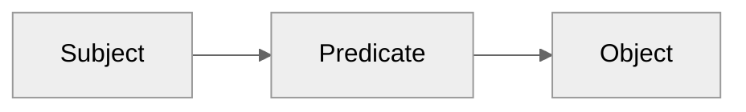

# 2025-06-06

I've continued working through things on claude. It's about time to try to
put things together in the repo.

The approach I'll take is to try to define the sub-vocabularies first and
then compose them together. I'll work on validator code along the way.
Hopefully, that helps make things clear.

# 2025-05-30

Researching with claude to see what exists. The geo world has a long history
(rasdaman, CF conventions, and STAC looked most useful). There's nothing remotely
modern though - looking for extensibility, multidimensionality, and flexible
transforms.

I developed an initial schema in Claude with what looks like a pretty interesting
example: `assets/example.landsat.json` using `schemas/mdarray.json`.

Example use:


```python

# Load and validate
metadata = MDArrayMetadata(json_content)
validator = MDArrayValidator(VOCABULARY_REGISTRY)
assert validator.validate_schema(metadata.metadata).valid

# Apply coordinate transforms
pixel_coords = (100, 200)  # row, col
utm_coords = metadata.apply_transform("image_to_utm", pixel_coords)
geo_coords = metadata.apply_transform("utm_to_geographic", utm_coords)

# Access categorical metadata
band_info = metadata.get_category_info("landsat8_bands", band_index=3)
# Returns: {"band_name": "Near Infrared", "wavelength_center_nm": 865, ...}

# Apply value transforms
raw_dn = 15000
reflectance = metadata.apply_transform("dn_to_reflectance", raw_dn)
# Returns: 0.2125 (surface reflectance)

# Access temporal events
event_info = metadata.get_temporal_event("acquisition_events", time_index=0)
# Returns: {"utc_timestamp": "2024-03-15T18:45:32Z", "spacecraft_clock": 1647363932, ...}
```

The conversation ran too long so now I'm trying to figur out how to export it?

Asked it to create a summary of [[schema development key findings]].

# 2025-05-19

## Relations

### RDF graphs



- [RDF triple](https://www.w3.org/TR/rdf11-concepts/#section-triples)
- [Internet resource identifier (IRI)](https://www.w3.org/TR/rdf11-concepts/#section-triples)

## Image data

I'll refer to $n$-dimensional images as **arrays**. In particular, images are
*scalar-valued* arrays. They map $n$-tuples to scalar values. I'll use the words
image and array interchangeably below. In general, *array* might also refer to
something with more complex value types (strings, vectors, structured data).
I'll ignore that below and focus on *scalar-valued arrays*.

An array is a an object mapping coordinates to values, hence it represents a
**scalar field**. **Coordinates** are ordered tuples of integers[^1]. Under the
usual vector addition and scalar multiplication rules, these form an field. That
field as embedded in a real-valued vector space with origin at $(0,...,0)$. This
is the **coordinate space** [^4].

The domain of coordinates over which an array has values is it's **extent**.
For an array with finite extent[^2], there is a minimal half-open interval for
each dimension within which the array has values. The outer product of all those
dimensions is an **axis aligned bounding box**. The size of those intervals
defines the array's **shape**.

## The problem and hypothesis

What would it look like to make a database combining images with tabular or
other data? Can we define a query language? What would that look like?

I think we can. There are just a handful of entities and a handful of predicates
to define.

### Dimension categories

- spatial (x,y,z,$\theta$,$\phi$)
- temporal (linear time, events)
- categorical (color)

These differ in how they are interpolated and transformed.

### Relational targets

- Scalar values - the values stored at each pixel
  - We may want to translate the value to a color via a lookup table.
  - The value might indicate the id of some object, like in a label field
- Coordinates - the index along each dimension
  - There might be metadata associated with each voxel - forming a new array - relate via a transform.
  - A particular index along a categorical dimension may correspond to the row of a table.
- Dimensions - defines the space
  - We may define a transformation that geometrically relates two spaces
  - Q: What's a use case where the dimension itself is part of a relation (besides a transform)?
    - Dimensions can have names, units, what about other data?
  - Q: What's a transform doing in the relational sense?
  - A dimension might correspond to an actuator (a device with a device id)
  - Spatial dimensions might be non-orthogonal, but that would be captured in the transform.


### Relation types

- key - lookup in another table based on value.
- transform -

### In-memory representations of image data

- linear projection (note back projection)
- morton order
- key-value

Probably the most important things about memory representation is where you
force the notion of an origin or finite extent.


[^1]: signed vs unsigned coordinates? It's useful to think of them as signed
[^2]: It's possible to consider dimensions of infinite extent. For example, when
      acquiring a video, we often don't know how long the video will be ahead of
      time; it could be infinitely long. Another example: it can be useful to
      draw on an infinite canvas, where we aren't bounding spatial dimensions ahead
      of time.
[^4]: Careful! It's easy to notionally switch between the integer field and the
      coordinate space. They're almost the same, but not quite.
