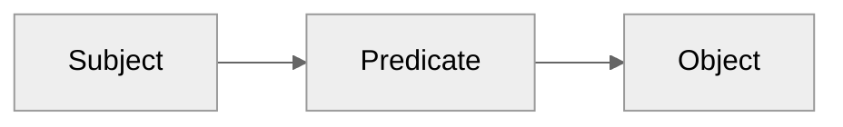

# 2025-05-19

## Relations

### RDF graphs

- [RDF triple](https://www.w3.org/TR/rdf11-concepts/#section-triples)
- [Internet resource identifier (IRI)](https://www.w3.org/TR/rdf11-concepts/#section-triples)

## Image data

I'll refer to $n$-dimensional images as **arrays**. In particular, images are
*scalar-valued* arrays. They map $n$-tuples to scalar values. I'll use the words
image and array interchangeably below. In general, *array* might also refer to
something with more complex value types (strings, vectors, structured data).
I'll ignore that below and focus on *scalar-valued arrays*.

### Dimension categories

- spatial (x,y,z,$\theta$,$\phi$)
- temporal (linear time, events)
- categorical (color)

These differ in how they are interpolated and transformed.

### Relational targets

- Scalar values - the values stored at each pixel
  - We may want to translate the value to a color via a lookup table.
  - The value might indicate the id of some object, like in a label field
- Coordinates - the index along each dimension
  - There might be metadata associated with each voxel - forming a new array - relate via a transform.
  - A particular index along a categorical dimension may correspond to the row of a table.
- Dimensions - defines the space
  - We may define a transformation that geometrically relates two spaces
  - Q: What's a use case where the dimension itself is part of a relation (besides a transform)?
    - Dimensions can have names, units, what about other data?
  - Q: What's a transform doing in the relational sense?
  - A dimension might correspond to an actuator (a device with a device id)
  - Spatial dimensions might be non-orthogonal, but that would be captured in the transform.

Coordinates are tuples of integers[^1]. Those integer tuples are integer-valued
vectors and form an integer field. That field as embedded in a real-valued
vector space with origin at $(0,...,0)$. This is the **coordinate space** [^4]. An
array is a an object mapping these coordinates to values, hence it represents a
**scalar field**.

The domain of coordinates over which an array has values is it's **extent**.
For an array with finite extent[^2], there is a minimal half-open interval for each
dimension within which the array has values. The outer product of all those
dimensions is an **axis aligned bounding box**. The size of those intervals
defines the array's **shape**.

### Relation types

- key - lookup in another table based on value.
- transform - 

### In-memory representations of image data

- linear projection (note back projection)
- morton order
- key-value

Probably the most important things about memory representation is where you
force the notion of an origin or finite extent.

[^1]: signed vs unsigned coordinates? It's useful to think of them as signed
[^2]: It's possible to consider dimensions of infinite extent. For example, when
      acquiring a video, we often don't know how long the video will be ahead of
      time; it could be infinitely long. Another example: it can be useful to
      draw on an infinite canvas, where we aren't bounding spatial dimensions ahead
      of time.
[^4]: Careful! It's easy to notionally switch between the integer field and the
      coordinate space. They're almost the same, but not quite.
      
