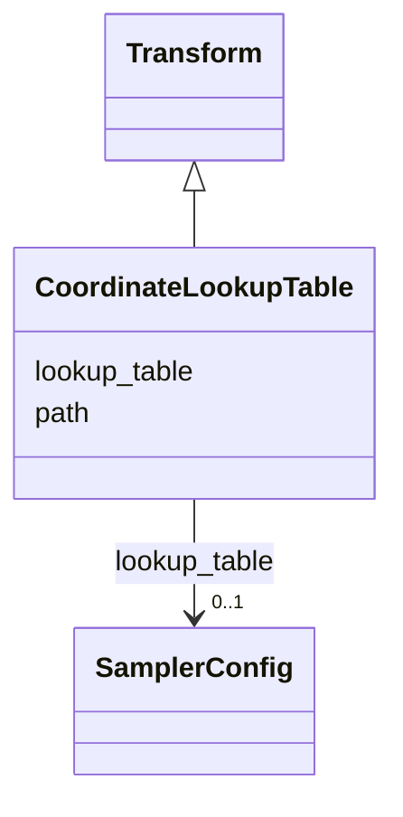

# Class: CoordinateLookupTable 


_Coordinate lookup table transform_


URI: [noid_spaces:CoordinateLookupTable](https://github.com/nclack/noid/schemas/space.v0.context.jsonldCoordinateLookupTable)





## Inheritance
* [Transform](Transform.md)
    * **CoordinateLookupTable**


## Slots

| Name | Cardinality and Range | Description | Inheritance |
| ---  | --- | --- | --- |
| [path](path.md) | 1 <br/> [String](String.md) | Path to coordinate lookup table data file | direct |
| [lookup_table](lookup_table.md) | 0..1 <br/> [SamplerConfig](SamplerConfig.md) | Coordinate lookup table configuration | direct |


## Identifier and Mapping Information


### Schema Source


* from schema: https://github.com/nclack/noid/schemas/v0/space.linkml.yaml


## Mappings

| Mapping Type | Mapped Value |
| ---  | ---  |
| self | noid_spaces:CoordinateLookupTable |
| native | noid_spaces:CoordinateLookupTable |


## LinkML Source

<!-- TODO: investigate https://stackoverflow.com/questions/37606292/how-to-create-tabbed-code-blocks-in-mkdocs-or-sphinx -->

### Direct

<details>
```yaml
name: CoordinateLookupTable
description: Coordinate lookup table transform
from_schema: https://github.com/nclack/noid/schemas/v0/space.linkml.yaml
is_a: Transform
attributes:
  path:
    name: path
    description: Path to coordinate lookup table data file
    from_schema: https://github.com/nclack/noid/schemas/v0/transform.linkml.yaml
    domain_of:
    - DisplacementLookupTable
    - CoordinateLookupTable
    range: string
    required: true
  lookup-table:
    name: lookup-table
    description: Coordinate lookup table configuration
    from_schema: https://github.com/nclack/noid/schemas/v0/transform.linkml.yaml
    rank: 1000
    domain_of:
    - CoordinateLookupTable
    range: SamplerConfig

```
</details>

### Induced

<details>
```yaml
name: CoordinateLookupTable
description: Coordinate lookup table transform
from_schema: https://github.com/nclack/noid/schemas/v0/space.linkml.yaml
is_a: Transform
attributes:
  path:
    name: path
    description: Path to coordinate lookup table data file
    from_schema: https://github.com/nclack/noid/schemas/v0/transform.linkml.yaml
    alias: path
    owner: CoordinateLookupTable
    domain_of:
    - DisplacementLookupTable
    - CoordinateLookupTable
    range: string
    required: true
  lookup-table:
    name: lookup-table
    description: Coordinate lookup table configuration
    from_schema: https://github.com/nclack/noid/schemas/v0/transform.linkml.yaml
    rank: 1000
    alias: lookup_table
    owner: CoordinateLookupTable
    domain_of:
    - CoordinateLookupTable
    range: SamplerConfig

```
</details>