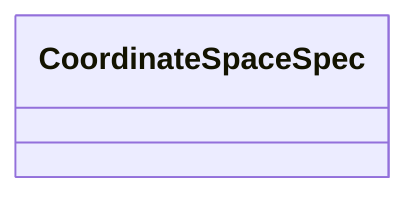

# Class: CoordinateSpaceSpec 


_Coordinate space specification that can be a string reference, dimension array, or inline CoordinateSystem._


URI: [noid_spaces:CoordinateSpaceSpec](https://github.com/nclack/noid/schemas/space.v0.context.jsonldCoordinateSpaceSpec)





<!-- no inheritance hierarchy -->


## Slots

| Name | Cardinality and Range | Description | Inheritance |
| ---  | --- | --- | --- |


## Usages

| used by | used in | type | used |
| ---  | --- | --- | --- |
| [CoordinateTransform](CoordinateTransform.md) | [input](input.md) | range | [CoordinateSpaceSpec](CoordinateSpaceSpec.md) |
| [CoordinateTransform](CoordinateTransform.md) | [output](output.md) | range | [CoordinateSpaceSpec](CoordinateSpaceSpec.md) |


## Identifier and Mapping Information


### Schema Source


* from schema: https://github.com/nclack/noid/schemas/v0/space.linkml.yaml


## Mappings

| Mapping Type | Mapped Value |
| ---  | ---  |
| self | noid_spaces:CoordinateSpaceSpec |
| native | noid_spaces:CoordinateSpaceSpec |


## LinkML Source

<!-- TODO: investigate https://stackoverflow.com/questions/37606292/how-to-create-tabbed-code-blocks-in-mkdocs-or-sphinx -->

### Direct

<details>
```yaml
name: CoordinateSpaceSpec
description: Coordinate space specification that can be a string reference, dimension
  array, or inline CoordinateSystem.
from_schema: https://github.com/nclack/noid/schemas/v0/space.linkml.yaml
union_of:
- string
- DimensionArray
- CoordinateSystem

```
</details>

### Induced

<details>
```yaml
name: CoordinateSpaceSpec
description: Coordinate space specification that can be a string reference, dimension
  array, or inline CoordinateSystem.
from_schema: https://github.com/nclack/noid/schemas/v0/space.linkml.yaml
union_of:
- string
- DimensionArray
- CoordinateSystem

```
</details>