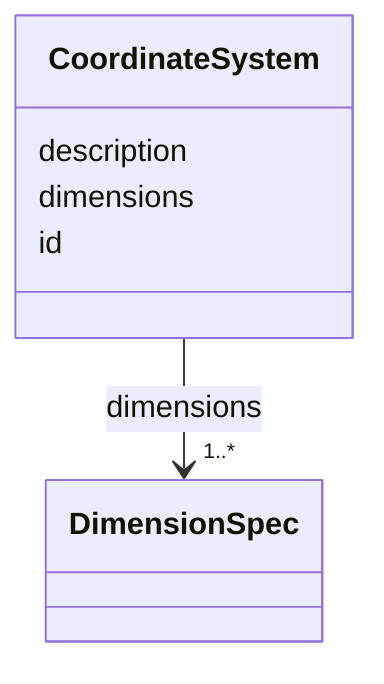

# Class: CoordinateSystem 


_Collection of dimensions that together define a coordinate space for positioning data elements._


URI: [noid_spaces:CoordinateSystem](https://github.com/nclack/noid/schemas/space.v0.context.jsonldCoordinateSystem)





<!-- no inheritance hierarchy -->


## Slots

| Name | Cardinality and Range | Description | Inheritance |
| ---  | --- | --- | --- |
| [id](id.md) | 1 <br/> [String](String.md) | Unique identifier for the coordinate system | direct |
| [dimensions](dimensions.md) | 1..* <br/> [DimensionSpec](DimensionSpec.md) | List of dimension specifications | direct |
| [description](description.md) | 0..1 <br/> [String](String.md) | Optional description of the coordinate system | direct |


## Identifier and Mapping Information


### Schema Source


* from schema: https://github.com/nclack/noid/schemas/v0/space.linkml.yaml


## Mappings

| Mapping Type | Mapped Value |
| ---  | ---  |
| self | noid_spaces:CoordinateSystem |
| native | noid_spaces:CoordinateSystem |


## LinkML Source

<!-- TODO: investigate https://stackoverflow.com/questions/37606292/how-to-create-tabbed-code-blocks-in-mkdocs-or-sphinx -->

### Direct

<details>
```yaml
name: CoordinateSystem
description: Collection of dimensions that together define a coordinate space for
  positioning data elements.
from_schema: https://github.com/nclack/noid/schemas/v0/space.linkml.yaml
attributes:
  id:
    name: id
    description: Unique identifier for the coordinate system
    from_schema: https://github.com/nclack/noid/schemas/v0/space.linkml.yaml
    identifier: true
    domain_of:
    - Dimension
    - CoordinateSystem
    - CoordinateTransform
    required: true
    pattern: ^.+$
  dimensions:
    name: dimensions
    description: List of dimension specifications
    from_schema: https://github.com/nclack/noid/schemas/v0/space.linkml.yaml
    rank: 1000
    domain_of:
    - CoordinateSystem
    - DimensionArray
    range: DimensionSpec
    required: true
    multivalued: true
    minimum_cardinality: 1
  description:
    name: description
    description: Optional description of the coordinate system
    from_schema: https://github.com/nclack/noid/schemas/v0/space.linkml.yaml
    rank: 1000
    domain_of:
    - CoordinateSystem
    - CoordinateTransform
    pattern: ^.+$

```
</details>

### Induced

<details>
```yaml
name: CoordinateSystem
description: Collection of dimensions that together define a coordinate space for
  positioning data elements.
from_schema: https://github.com/nclack/noid/schemas/v0/space.linkml.yaml
attributes:
  id:
    name: id
    description: Unique identifier for the coordinate system
    from_schema: https://github.com/nclack/noid/schemas/v0/space.linkml.yaml
    identifier: true
    alias: id
    owner: CoordinateSystem
    domain_of:
    - Dimension
    - CoordinateSystem
    - CoordinateTransform
    range: string
    required: true
    pattern: ^.+$
  dimensions:
    name: dimensions
    description: List of dimension specifications
    from_schema: https://github.com/nclack/noid/schemas/v0/space.linkml.yaml
    rank: 1000
    alias: dimensions
    owner: CoordinateSystem
    domain_of:
    - CoordinateSystem
    - DimensionArray
    range: DimensionSpec
    required: true
    multivalued: true
    minimum_cardinality: 1
  description:
    name: description
    description: Optional description of the coordinate system
    from_schema: https://github.com/nclack/noid/schemas/v0/space.linkml.yaml
    rank: 1000
    alias: description
    owner: CoordinateSystem
    domain_of:
    - CoordinateSystem
    - CoordinateTransform
    range: string
    pattern: ^.+$

```
</details>