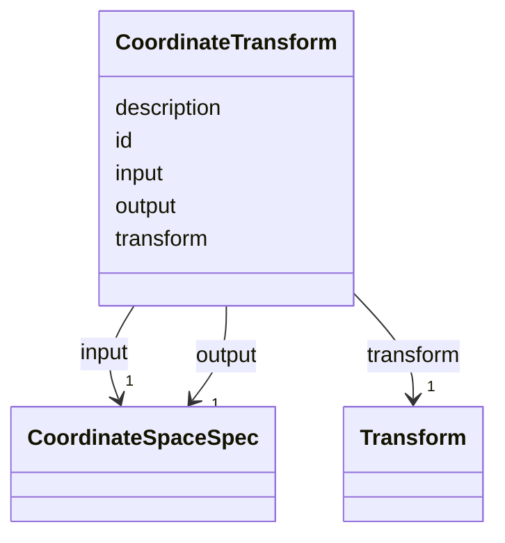

# Class: CoordinateTransform 


_Mathematical mapping between input and output coordinate spaces with transform definition._


URI: [noid_spaces:CoordinateTransform](https://github.com/nclack/noid/schemas/space.v0.context.jsonldCoordinateTransform)





<!-- no inheritance hierarchy -->


## Slots

| Name | Cardinality and Range | Description | Inheritance |
| ---  | --- | --- | --- |
| [id](id.md) | 1 <br/> [String](String.md) | Unique identifier for the coordinate transform | direct |
| [input](input.md) | 1 <br/> [CoordinateSpaceSpec](CoordinateSpaceSpec.md) | Input coordinate space specification | direct |
| [output](output.md) | 1 <br/> [CoordinateSpaceSpec](CoordinateSpaceSpec.md) | Output coordinate space specification | direct |
| [transform](transform.md) | 1 <br/> [Transform](Transform.md) | Transform definition from noid_transform schema | direct |
| [description](description.md) | 0..1 <br/> [String](String.md) | Optional description of the coordinate transform | direct |


## Identifier and Mapping Information


### Schema Source


* from schema: https://github.com/nclack/noid/schemas/v0/space.linkml.yaml


## Mappings

| Mapping Type | Mapped Value |
| ---  | ---  |
| self | noid_spaces:CoordinateTransform |
| native | noid_spaces:CoordinateTransform |


## LinkML Source

<!-- TODO: investigate https://stackoverflow.com/questions/37606292/how-to-create-tabbed-code-blocks-in-mkdocs-or-sphinx -->

### Direct

<details>
```yaml
name: CoordinateTransform
description: Mathematical mapping between input and output coordinate spaces with
  transform definition.
from_schema: https://github.com/nclack/noid/schemas/v0/space.linkml.yaml
attributes:
  id:
    name: id
    description: Unique identifier for the coordinate transform
    from_schema: https://github.com/nclack/noid/schemas/v0/space.linkml.yaml
    identifier: true
    domain_of:
    - Dimension
    - CoordinateSystem
    - CoordinateTransform
    required: true
    pattern: ^.+$
  input:
    name: input
    description: Input coordinate space specification
    from_schema: https://github.com/nclack/noid/schemas/v0/space.linkml.yaml
    rank: 1000
    domain_of:
    - CoordinateTransform
    range: CoordinateSpaceSpec
    required: true
  output:
    name: output
    description: Output coordinate space specification
    from_schema: https://github.com/nclack/noid/schemas/v0/space.linkml.yaml
    rank: 1000
    domain_of:
    - CoordinateTransform
    range: CoordinateSpaceSpec
    required: true
  transform:
    name: transform
    description: Transform definition from noid_transform schema
    from_schema: https://github.com/nclack/noid/schemas/v0/space.linkml.yaml
    rank: 1000
    domain_of:
    - CoordinateTransform
    range: Transform
    required: true
  description:
    name: description
    description: Optional description of the coordinate transform
    from_schema: https://github.com/nclack/noid/schemas/v0/space.linkml.yaml
    domain_of:
    - CoordinateSystem
    - CoordinateTransform
    pattern: ^.+$

```
</details>

### Induced

<details>
```yaml
name: CoordinateTransform
description: Mathematical mapping between input and output coordinate spaces with
  transform definition.
from_schema: https://github.com/nclack/noid/schemas/v0/space.linkml.yaml
attributes:
  id:
    name: id
    description: Unique identifier for the coordinate transform
    from_schema: https://github.com/nclack/noid/schemas/v0/space.linkml.yaml
    identifier: true
    alias: id
    owner: CoordinateTransform
    domain_of:
    - Dimension
    - CoordinateSystem
    - CoordinateTransform
    range: string
    required: true
    pattern: ^.+$
  input:
    name: input
    description: Input coordinate space specification
    from_schema: https://github.com/nclack/noid/schemas/v0/space.linkml.yaml
    rank: 1000
    alias: input
    owner: CoordinateTransform
    domain_of:
    - CoordinateTransform
    range: CoordinateSpaceSpec
    required: true
  output:
    name: output
    description: Output coordinate space specification
    from_schema: https://github.com/nclack/noid/schemas/v0/space.linkml.yaml
    rank: 1000
    alias: output
    owner: CoordinateTransform
    domain_of:
    - CoordinateTransform
    range: CoordinateSpaceSpec
    required: true
  transform:
    name: transform
    description: Transform definition from noid_transform schema
    from_schema: https://github.com/nclack/noid/schemas/v0/space.linkml.yaml
    rank: 1000
    alias: transform
    owner: CoordinateTransform
    domain_of:
    - CoordinateTransform
    range: Transform
    required: true
  description:
    name: description
    description: Optional description of the coordinate transform
    from_schema: https://github.com/nclack/noid/schemas/v0/space.linkml.yaml
    alias: description
    owner: CoordinateTransform
    domain_of:
    - CoordinateSystem
    - CoordinateTransform
    range: string
    pattern: ^.+$

```
</details>