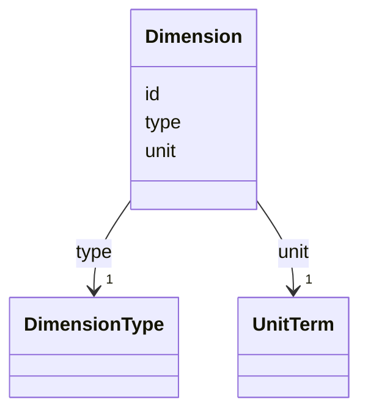

# Class: Dimension 


_A single axis within a coordinate space with its measurement unit and classification._


URI: [noid_spaces:Dimension](https://github.com/nclack/noid/schemas/space.v0.context.jsonldDimension)





<!-- no inheritance hierarchy -->


## Slots

| Name | Cardinality and Range | Description | Inheritance |
| ---  | --- | --- | --- |
| [id](id.md) | 1 <br/> [String](String.md) | Unique identifier for the dimension | direct |
| [unit](unit.md) | 1 <br/> [UnitTerm](UnitTerm.md) | Unit of measurement from controlled vocabulary | direct |
| [type](type.md) | 1 <br/> [DimensionType](DimensionType.md) | Dimension type classification | direct |


## Identifier and Mapping Information


### Schema Source


* from schema: https://github.com/nclack/noid/schemas/v0/space.linkml.yaml


## Mappings

| Mapping Type | Mapped Value |
| ---  | ---  |
| self | noid_spaces:Dimension |
| native | noid_spaces:Dimension |


## LinkML Source

<!-- TODO: investigate https://stackoverflow.com/questions/37606292/how-to-create-tabbed-code-blocks-in-mkdocs-or-sphinx -->

### Direct

<details>
```yaml
name: Dimension
description: A single axis within a coordinate space with its measurement unit and
  classification.
from_schema: https://github.com/nclack/noid/schemas/v0/space.linkml.yaml
attributes:
  id:
    name: id
    description: Unique identifier for the dimension
    from_schema: https://github.com/nclack/noid/schemas/v0/space.linkml.yaml
    rank: 1000
    identifier: true
    domain_of:
    - Dimension
    - CoordinateSystem
    - CoordinateTransform
    required: true
    pattern: ^.+$
  unit:
    name: unit
    description: Unit of measurement from controlled vocabulary
    from_schema: https://github.com/nclack/noid/schemas/v0/space.linkml.yaml
    rank: 1000
    domain_of:
    - Dimension
    range: UnitTerm
    required: true
  type:
    name: type
    description: Dimension type classification
    from_schema: https://github.com/nclack/noid/schemas/v0/space.linkml.yaml
    rank: 1000
    domain_of:
    - Dimension
    range: DimensionType
    required: true
rules:
- preconditions:
    slot_conditions:
      type:
        name: type
        equals_string: index
  postconditions:
    slot_conditions:
      unit:
        name: unit
        equals_string: index
  description: If type is "index", then unit MUST be "index"
  title: Index type must have index unit

```
</details>

### Induced

<details>
```yaml
name: Dimension
description: A single axis within a coordinate space with its measurement unit and
  classification.
from_schema: https://github.com/nclack/noid/schemas/v0/space.linkml.yaml
attributes:
  id:
    name: id
    description: Unique identifier for the dimension
    from_schema: https://github.com/nclack/noid/schemas/v0/space.linkml.yaml
    rank: 1000
    identifier: true
    alias: id
    owner: Dimension
    domain_of:
    - Dimension
    - CoordinateSystem
    - CoordinateTransform
    range: string
    required: true
    pattern: ^.+$
  unit:
    name: unit
    description: Unit of measurement from controlled vocabulary
    from_schema: https://github.com/nclack/noid/schemas/v0/space.linkml.yaml
    rank: 1000
    alias: unit
    owner: Dimension
    domain_of:
    - Dimension
    range: UnitTerm
    required: true
  type:
    name: type
    description: Dimension type classification
    from_schema: https://github.com/nclack/noid/schemas/v0/space.linkml.yaml
    rank: 1000
    alias: type
    owner: Dimension
    domain_of:
    - Dimension
    range: DimensionType
    required: true
rules:
- preconditions:
    slot_conditions:
      type:
        name: type
        equals_string: index
  postconditions:
    slot_conditions:
      unit:
        name: unit
        equals_string: index
  description: If type is "index", then unit MUST be "index"
  title: Index type must have index unit

```
</details>