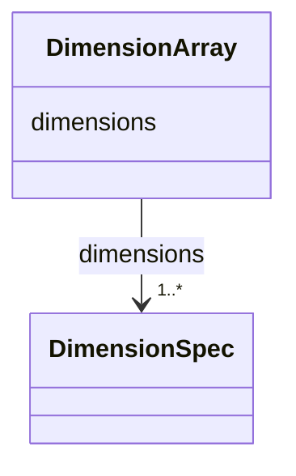

# Class: DimensionArray 


_Array of dimension specifications_


URI: [noid_spaces:DimensionArray](https://github.com/nclack/noid/schemas/space.v0.context.jsonldDimensionArray)





<!-- no inheritance hierarchy -->


## Slots

| Name | Cardinality and Range | Description | Inheritance |
| ---  | --- | --- | --- |
| [dimensions](dimensions.md) | 1..* <br/> [DimensionSpec](DimensionSpec.md) |  | direct |


## Identifier and Mapping Information


### Schema Source


* from schema: https://github.com/nclack/noid/schemas/v0/space.linkml.yaml


## Mappings

| Mapping Type | Mapped Value |
| ---  | ---  |
| self | noid_spaces:DimensionArray |
| native | noid_spaces:DimensionArray |


## LinkML Source

<!-- TODO: investigate https://stackoverflow.com/questions/37606292/how-to-create-tabbed-code-blocks-in-mkdocs-or-sphinx -->

### Direct

<details>
```yaml
name: DimensionArray
description: Array of dimension specifications
from_schema: https://github.com/nclack/noid/schemas/v0/space.linkml.yaml
attributes:
  dimensions:
    name: dimensions
    from_schema: https://github.com/nclack/noid/schemas/v0/space.linkml.yaml
    domain_of:
    - CoordinateSystem
    - DimensionArray
    range: DimensionSpec
    multivalued: true
    minimum_cardinality: 1

```
</details>

### Induced

<details>
```yaml
name: DimensionArray
description: Array of dimension specifications
from_schema: https://github.com/nclack/noid/schemas/v0/space.linkml.yaml
attributes:
  dimensions:
    name: dimensions
    from_schema: https://github.com/nclack/noid/schemas/v0/space.linkml.yaml
    alias: dimensions
    owner: DimensionArray
    domain_of:
    - CoordinateSystem
    - DimensionArray
    range: DimensionSpec
    multivalued: true
    minimum_cardinality: 1

```
</details>