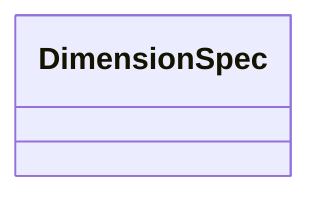

# Class: DimensionSpec 


_Dimension specification that can be either a string reference or inline Dimension object._


URI: [noid_spaces:DimensionSpec](https://github.com/nclack/noid/schemas/space.v0.context.jsonldDimensionSpec)





<!-- no inheritance hierarchy -->


## Slots

| Name | Cardinality and Range | Description | Inheritance |
| ---  | --- | --- | --- |


## Usages

| used by | used in | type | used |
| ---  | --- | --- | --- |
| [CoordinateSystem](CoordinateSystem.md) | [dimensions](dimensions.md) | range | [DimensionSpec](DimensionSpec.md) |
| [DimensionArray](DimensionArray.md) | [dimensions](dimensions.md) | range | [DimensionSpec](DimensionSpec.md) |


## Identifier and Mapping Information


### Schema Source


* from schema: https://github.com/nclack/noid/schemas/v0/space.linkml.yaml


## Mappings

| Mapping Type | Mapped Value |
| ---  | ---  |
| self | noid_spaces:DimensionSpec |
| native | noid_spaces:DimensionSpec |


## LinkML Source

<!-- TODO: investigate https://stackoverflow.com/questions/37606292/how-to-create-tabbed-code-blocks-in-mkdocs-or-sphinx -->

### Direct

<details>
```yaml
name: DimensionSpec
description: Dimension specification that can be either a string reference or inline
  Dimension object.
from_schema: https://github.com/nclack/noid/schemas/v0/space.linkml.yaml
union_of:
- string
- Dimension

```
</details>

### Induced

<details>
```yaml
name: DimensionSpec
description: Dimension specification that can be either a string reference or inline
  Dimension object.
from_schema: https://github.com/nclack/noid/schemas/v0/space.linkml.yaml
union_of:
- string
- Dimension

```
</details>