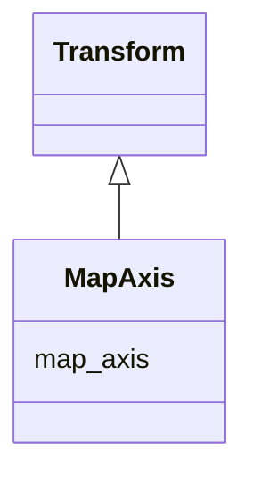

# Class: MapAxis 


_Axis permutation transform_


URI: [noid_spaces:MapAxis](https://github.com/nclack/noid/schemas/space.v0.context.jsonldMapAxis)





## Inheritance
* [Transform](Transform.md)
    * **MapAxis**


## Slots

| Name | Cardinality and Range | Description | Inheritance |
| ---  | --- | --- | --- |
| [map_axis](map_axis.md) | 1..* <br/> [Integer](Integer.md) | Permutation vector of 0-based input dimension indices | direct |


## Identifier and Mapping Information


### Schema Source


* from schema: https://github.com/nclack/noid/schemas/v0/space.linkml.yaml


## Mappings

| Mapping Type | Mapped Value |
| ---  | ---  |
| self | noid_spaces:MapAxis |
| native | noid_spaces:MapAxis |


## LinkML Source

<!-- TODO: investigate https://stackoverflow.com/questions/37606292/how-to-create-tabbed-code-blocks-in-mkdocs-or-sphinx -->

### Direct

<details>
```yaml
name: MapAxis
description: Axis permutation transform
from_schema: https://github.com/nclack/noid/schemas/v0/space.linkml.yaml
is_a: Transform
attributes:
  map-axis:
    name: map-axis
    description: Permutation vector of 0-based input dimension indices. Array length
      equals number of output dimensions. Each value specifies which input dimension
      maps to the corresponding output dimension.
    from_schema: https://github.com/nclack/noid/schemas/v0/transform.linkml.yaml
    rank: 1000
    list_elements_ordered: true
    domain_of:
    - MapAxis
    range: integer
    required: true
    multivalued: true
    minimum_value: 0

```
</details>

### Induced

<details>
```yaml
name: MapAxis
description: Axis permutation transform
from_schema: https://github.com/nclack/noid/schemas/v0/space.linkml.yaml
is_a: Transform
attributes:
  map-axis:
    name: map-axis
    description: Permutation vector of 0-based input dimension indices. Array length
      equals number of output dimensions. Each value specifies which input dimension
      maps to the corresponding output dimension.
    from_schema: https://github.com/nclack/noid/schemas/v0/transform.linkml.yaml
    rank: 1000
    list_elements_ordered: true
    alias: map_axis
    owner: MapAxis
    domain_of:
    - MapAxis
    range: integer
    required: true
    multivalued: true
    minimum_value: 0

```
</details>