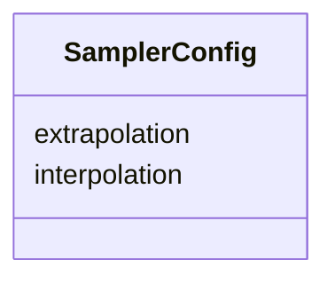

# Class: SamplerConfig 


_Configuration for sampling transforms (displacements and lookup tables)_


URI: [noid_transform:SamplerConfig](https://github.com/nclack/noid/transforms/transform/SamplerConfig)





<!-- no inheritance hierarchy -->


## Slots

| Name | Cardinality and Range | Description | Inheritance |
| ---  | --- | --- | --- |
| [interpolation](interpolation.md) | 0..1 <br/> [String](String.md)&nbsp;or&nbsp;<br />[InterpolationMethod](InterpolationMethod.md)&nbsp;or&nbsp;<br />[String](String.md) | Interpolation method | direct |
| [extrapolation](extrapolation.md) | 0..1 <br/> [String](String.md)&nbsp;or&nbsp;<br />[ExtrapolationMethod](ExtrapolationMethod.md)&nbsp;or&nbsp;<br />[String](String.md) | Extrapolation method | direct |


## Usages

| used by | used in | type | used |
| ---  | --- | --- | --- |
| [DisplacementLookupTable](DisplacementLookupTable.md) | [displacements](displacements.md) | range | [SamplerConfig](SamplerConfig.md) |
| [CoordinateLookupTable](CoordinateLookupTable.md) | [lookup_table](lookup_table.md) | range | [SamplerConfig](SamplerConfig.md) |


## Identifier and Mapping Information


### Schema Source


* from schema: https://github.com/nclack/noid/transforms/transform.linkml


## Mappings

| Mapping Type | Mapped Value |
| ---  | ---  |
| self | noid_transform:SamplerConfig |
| native | noid_transform:SamplerConfig |


## LinkML Source

<!-- TODO: investigate https://stackoverflow.com/questions/37606292/how-to-create-tabbed-code-blocks-in-mkdocs-or-sphinx -->

### Direct

<details>
```yaml
name: SamplerConfig
description: Configuration for sampling transforms (displacements and lookup tables)
from_schema: https://github.com/nclack/noid/transforms/transform.linkml
attributes:
  interpolation:
    name: interpolation
    description: Interpolation method
    from_schema: https://github.com/nclack/noid/transforms/sampler.linkml
    rank: 1000
    ifabsent: string(nearest)
    domain_of:
    - SamplerConfig
    any_of:
    - range: InterpolationMethod
    - range: string
  extrapolation:
    name: extrapolation
    description: Extrapolation method
    from_schema: https://github.com/nclack/noid/transforms/sampler.linkml
    rank: 1000
    ifabsent: string(nearest)
    domain_of:
    - SamplerConfig
    any_of:
    - range: ExtrapolationMethod
    - range: string

```
</details>

### Induced

<details>
```yaml
name: SamplerConfig
description: Configuration for sampling transforms (displacements and lookup tables)
from_schema: https://github.com/nclack/noid/transforms/transform.linkml
attributes:
  interpolation:
    name: interpolation
    description: Interpolation method
    from_schema: https://github.com/nclack/noid/transforms/sampler.linkml
    rank: 1000
    ifabsent: string(nearest)
    alias: interpolation
    owner: SamplerConfig
    domain_of:
    - SamplerConfig
    any_of:
    - range: InterpolationMethod
    - range: string
  extrapolation:
    name: extrapolation
    description: Extrapolation method
    from_schema: https://github.com/nclack/noid/transforms/sampler.linkml
    rank: 1000
    ifabsent: string(nearest)
    alias: extrapolation
    owner: SamplerConfig
    domain_of:
    - SamplerConfig
    any_of:
    - range: ExtrapolationMethod
    - range: string

```
</details>