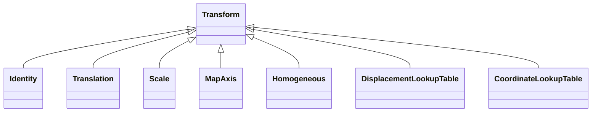

# Class: Transform 


_A coordinate transformation with self-describing parameters_


* __NOTE__: this is an abstract class and should not be instantiated directly


URI: [noid_transform:Transform](https://github.com/nclack/noid/schemas/transform/Transform)





## Inheritance
* **Transform**
    * [Identity](Identity.md)
    * [Translation](Translation.md)
    * [Scale](Scale.md)
    * [MapAxis](MapAxis.md)
    * [Homogeneous](Homogeneous.md)
    * [DisplacementLookupTable](DisplacementLookupTable.md)
    * [CoordinateLookupTable](CoordinateLookupTable.md)


## Slots

| Name | Cardinality and Range | Description | Inheritance |
| ---  | --- | --- | --- |


## Identifier and Mapping Information


### Schema Source


* from schema: https://github.com/nclack/noid/schemas/transform/v0.linkml


## Mappings

| Mapping Type | Mapped Value |
| ---  | ---  |
| self | noid_transform:Transform |
| native | noid_transform:Transform |


## LinkML Source

<!-- TODO: investigate https://stackoverflow.com/questions/37606292/how-to-create-tabbed-code-blocks-in-mkdocs-or-sphinx -->

### Direct

<details>
```yaml
name: Transform
description: A coordinate transformation with self-describing parameters
from_schema: https://github.com/nclack/noid/schemas/transform/v0.linkml
abstract: true

```
</details>

### Induced

<details>
```yaml
name: Transform
description: A coordinate transformation with self-describing parameters
from_schema: https://github.com/nclack/noid/schemas/transform/v0.linkml
abstract: true

```
</details>