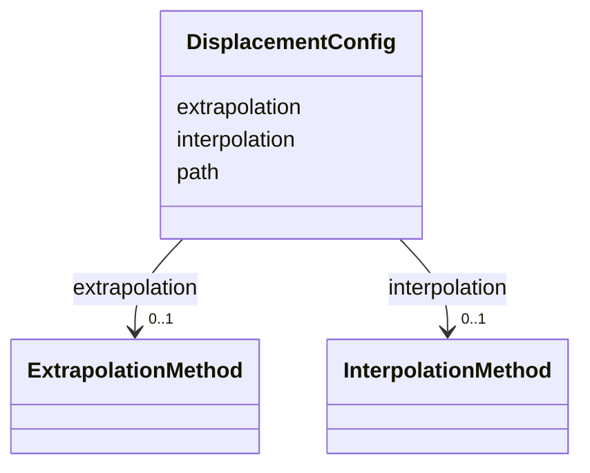

# Class: DisplacementConfig 


_Configuration for displacement field_


URI: [noid_transforms:DisplacementConfig](https://github.com/nclack/noid/schemas/transforms/DisplacementConfig)





<!-- no inheritance hierarchy -->


## Slots

| Name | Cardinality and Range | Description | Inheritance |
| ---  | --- | --- | --- |
| [path](path.md) | 1 <br/> [String](String.md) | Path to displacement field | direct |
| [interpolation](interpolation.md) | 0..1 <br/> [InterpolationMethod](InterpolationMethod.md) | Interpolation method | direct |
| [extrapolation](extrapolation.md) | 0..1 <br/> [ExtrapolationMethod](ExtrapolationMethod.md) | Extrapolation method | direct |


## Usages

| used by | used in | type | used |
| ---  | --- | --- | --- |
| [DisplacementLookupTable](DisplacementLookupTable.md) | [displacements](displacements.md) | any_of[range] | [DisplacementConfig](DisplacementConfig.md) |


## Identifier and Mapping Information


### Schema Source


* from schema: https://github.com/nclack/noid/schemas/transforms/transforms.linkml


## Mappings

| Mapping Type | Mapped Value |
| ---  | ---  |
| self | noid_transforms:DisplacementConfig |
| native | noid_transforms:DisplacementConfig |


## LinkML Source

<!-- TODO: investigate https://stackoverflow.com/questions/37606292/how-to-create-tabbed-code-blocks-in-mkdocs-or-sphinx -->

### Direct

<details>
```yaml
name: DisplacementConfig
description: Configuration for displacement field
from_schema: https://github.com/nclack/noid/schemas/transforms/transforms.linkml
attributes:
  path:
    name: path
    description: Path to displacement field
    from_schema: https://github.com/nclack/noid/schemas/transforms/transforms.linkml
    rank: 1000
    domain_of:
    - DisplacementConfig
    - LookupTableConfig
    range: string
    required: true
  interpolation:
    name: interpolation
    description: Interpolation method
    from_schema: https://github.com/nclack/noid/schemas/transforms/transforms.linkml
    rank: 1000
    domain_of:
    - DisplacementConfig
    - LookupTableConfig
    range: InterpolationMethod
  extrapolation:
    name: extrapolation
    description: Extrapolation method
    from_schema: https://github.com/nclack/noid/schemas/transforms/transforms.linkml
    rank: 1000
    domain_of:
    - DisplacementConfig
    - LookupTableConfig
    range: ExtrapolationMethod

```
</details>

### Induced

<details>
```yaml
name: DisplacementConfig
description: Configuration for displacement field
from_schema: https://github.com/nclack/noid/schemas/transforms/transforms.linkml
attributes:
  path:
    name: path
    description: Path to displacement field
    from_schema: https://github.com/nclack/noid/schemas/transforms/transforms.linkml
    rank: 1000
    alias: path
    owner: DisplacementConfig
    domain_of:
    - DisplacementConfig
    - LookupTableConfig
    range: string
    required: true
  interpolation:
    name: interpolation
    description: Interpolation method
    from_schema: https://github.com/nclack/noid/schemas/transforms/transforms.linkml
    rank: 1000
    alias: interpolation
    owner: DisplacementConfig
    domain_of:
    - DisplacementConfig
    - LookupTableConfig
    range: InterpolationMethod
  extrapolation:
    name: extrapolation
    description: Extrapolation method
    from_schema: https://github.com/nclack/noid/schemas/transforms/transforms.linkml
    rank: 1000
    alias: extrapolation
    owner: DisplacementConfig
    domain_of:
    - DisplacementConfig
    - LookupTableConfig
    range: ExtrapolationMethod

```
</details>