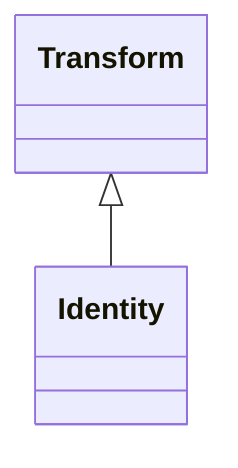

# Class: Identity 


_Identity transform_


URI: [noid_transforms:Identity](https://github.com/nclack/noid/transforms/Identity)





## Inheritance
* [Transform](Transform.md)
    * **Identity**


## Slots

| Name | Cardinality and Range | Description | Inheritance |
| ---  | --- | --- | --- |


## Identifier and Mapping Information


### Schema Source


* from schema: https://github.com/nclack/noid/transforms/transforms.linkml


## Mappings

| Mapping Type | Mapped Value |
| ---  | ---  |
| self | noid_transforms:Identity |
| native | noid_transforms:Identity |


## LinkML Source

<!-- TODO: investigate https://stackoverflow.com/questions/37606292/how-to-create-tabbed-code-blocks-in-mkdocs-or-sphinx -->

### Direct

<details>
```yaml
name: Identity
description: Identity transform
from_schema: https://github.com/nclack/noid/transforms/transforms.linkml
is_a: Transform

```
</details>

### Induced

<details>
```yaml
name: Identity
description: Identity transform
from_schema: https://github.com/nclack/noid/transforms/transforms.linkml
is_a: Transform

```
</details>